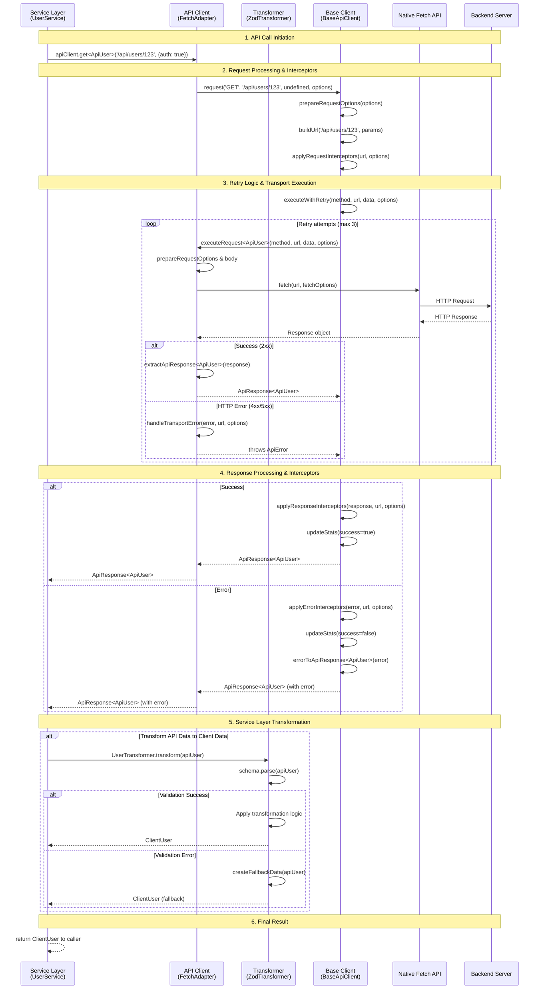

# Unified API Client Interface Plan

## Current State Analysis

### API Calling Patterns Found
1. **fetch** - Direct usage in services (UserManagementService, etc.)
2. **axiosInstance** - Configured instance with interceptors from `utils/axiosConfig.ts`
3. **apiRequest/apiRequestVoid** - Utility functions using fetch from `utils/apiClient.ts`
4. **axios** - Direct library usage in various services

### Response Format Issues
- **Backend** uses `ApiResponse<T>` with `{ success: boolean, data: T, message?: string }`
- **Frontend** expects `IServiceResponse<T>` with `{ success: boolean, data?: T, error?: string, errorCode?: string, statusCode?: number }`
- Inconsistent error handling across different HTTP clients
- Each service handles authentication and error mapping differently

### Specific Problems Identified
- **UserManagementService**: Uses fetch directly with manual token injection
- **axiosInstance**: Has response interceptors but inconsistent error format
- **apiClient**: Good error handling but limited to fetch
- **Mixed approaches**: Different services use different patterns

## Proposed Solution

### 1. Shared Type Definitions Package (`@draco/shared-types`)

Create a shared package for type definitions used by both frontend and backend:

```typescript
// Core API Response Types
export interface ApiResponse<T> {
  success: boolean;
  data: T;
  message?: string;
}

export interface ApiError {
  success: false;
  errorCode: string;
  errorMessage: string;
  statusCode: number;
  details?: unknown;
}

// Client Response Types
export interface ClientResponse<T> {
  success: boolean;
  data?: T;
  error?: string;
  errorCode?: string;
  statusCode?: number;
}

// Request Configuration
export interface RequestOptions {
  headers?: Record<string, string>;
  timeout?: number;
  retries?: number;
  validateResponse?: boolean;
}

export interface ApiClientConfig {
  baseURL?: string;
  timeout?: number;
  retries?: number;
  authTokenProvider?: () => string | null;
  errorHandler?: (error: ApiError) => void;
}
```

**Structure:**
```
draco-shared-types/
├── src/
│   ├── api/           # API response interfaces
│   │   ├── responses.ts
│   │   ├── errors.ts
│   │   └── index.ts
│   ├── client/        # Client-specific types  
│   │   ├── config.ts
│   │   ├── requests.ts
│   │   └── index.ts
│   ├── validation/    # Zod schemas for runtime validation
│   │   ├── schemas.ts
│   │   └── index.ts
│   └── index.ts       # Main exports
├── package.json
├── tsconfig.json
└── README.md
```

### 2. Unified API Client Interface

Create a transport-agnostic API client interface:

```typescript
interface ApiClient {
  // HTTP Methods
  get<T>(endpoint: string, options?: RequestOptions): Promise<ClientResponse<T>>;
  post<T>(endpoint: string, data?: unknown, options?: RequestOptions): Promise<ClientResponse<T>>;
  put<T>(endpoint: string, data?: unknown, options?: RequestOptions): Promise<ClientResponse<T>>;
  delete<T>(endpoint: string, options?: RequestOptions): Promise<ClientResponse<T>>;
  patch<T>(endpoint: string, data?: unknown, options?: RequestOptions): Promise<ClientResponse<T>>;
  
  // Configuration
  configure(config: Partial<ApiClientConfig>): void;
  setAuthToken(token: string | null): void;
  
  // Utility Methods
  uploadFile<T>(endpoint: string, file: File, data?: Record<string, unknown>): Promise<ClientResponse<T>>;
  downloadFile(endpoint: string): Promise<Blob>;
}
```

**Key Features:**
- **Transport Agnostic**: Supports fetch, axios, or any HTTP client
- **Automatic Token Injection**: JWT handling via configuration
- **Standardized Error Handling**: Converts all errors to consistent `ClientResponse<T>` format
- **Type Safety**: Full TypeScript support with shared interfaces
- **Response Transformation**: Backend `ApiResponse<T>` → Frontend `ClientResponse<T>`
- **File Upload/Download**: Built-in support for file operations
- **Retry Logic**: Configurable retry with exponential backoff

### 3. Implementation Structure

```
draco-nodejs/shared/
└── api-client/
    ├── src/
    │   ├── ApiClient.ts          # Main interface definition
    │   ├── BaseApiClient.ts      # Abstract base implementation
    │   ├── adapters/
    │   │   ├── FetchAdapter.ts   # Fetch implementation
    │   │   ├── AxiosAdapter.ts   # Axios implementation
    │   │   └── MockAdapter.ts    # Testing mock
    │   ├── interceptors/
    │   │   ├── AuthInterceptor.ts
    │   │   ├── RetryInterceptor.ts
    │   │   └── LoggingInterceptor.ts
    │   ├── errors/
    │   │   ├── ErrorHandler.ts   # Standardized error processing
    │   │   ├── ErrorTypes.ts     # Error categorization
    │   │   └── RetryPolicy.ts    # Retry logic
    │   ├── transformers/
    │   │   ├── ResponseTransformer.ts  # Backend → Frontend format
    │   │   └── RequestTransformer.ts   # Request preprocessing
    │   ├── validation/
    │   │   ├── ResponseValidator.ts    # Runtime type checking
    │   │   └── SchemaRegistry.ts      # Validation schema management
    │   └── index.ts              # Public API exports
    ├── tests/
    │   ├── unit/
    │   ├── integration/
    │   └── mocks/
    ├── package.json
    ├── tsconfig.json
    └── README.md
```

### 4. Enhanced Error System

Implement structured error handling with categories:

```typescript
export enum ErrorCategory {
  NETWORK = 'NETWORK',
  AUTHENTICATION = 'AUTHENTICATION', 
  AUTHORIZATION = 'AUTHORIZATION',
  VALIDATION = 'VALIDATION',
  SERVER_ERROR = 'SERVER_ERROR',
  CLIENT_ERROR = 'CLIENT_ERROR',
  TIMEOUT = 'TIMEOUT',
  UNKNOWN = 'UNKNOWN'
}

export interface StructuredError {
  category: ErrorCategory;
  code: string;
  message: string;
  statusCode?: number;
  retryable: boolean;
  context?: Record<string, unknown>;
}
```

**Error Code Standards:**
- `AUTH_TOKEN_EXPIRED` - JWT token needs refresh
- `VALIDATION_FAILED` - Request data validation failed
- `NETWORK_ERROR` - Connection/network issues
- `SERVER_ERROR` - 5xx server errors
- `PERMISSION_DENIED` - 403 authorization failures

### 5. Usage Examples

**Service Implementation:**
```typescript
// Before (UserManagementService)
const response = await fetch(`/api/accounts/${accountId}/contacts`, {
  headers: { Authorization: `Bearer ${this.token}` }
});
if (!response.ok) {
  throw new Error('Failed to load users');
}

// After (with unified client)
const result = await apiClient.get<ContactsResponse>(`/api/accounts/${accountId}/contacts`);
if (!result.success) {
  throw new Error(result.error);
}
```

**Type-Safe Endpoints:**
```typescript
// Define endpoint types in shared package
export interface GetContactsEndpoint {
  path: `/api/accounts/${string}/contacts`;
  method: 'GET';
  response: ContactsResponse;
  errors: 'PERMISSION_DENIED' | 'ACCOUNT_NOT_FOUND';
}

// Usage with full type safety
const result = await apiClient.get<GetContactsEndpoint['response']>(
  `/api/accounts/${accountId}/contacts`
);
```

### 6. API Call Flow Architecture

The following UML sequence diagram illustrates the complete end-to-end flow of an API call through the unified client architecture, from service layer initiation to final transformed result:



#### Flow Phase Descriptions

**Phase 1: API Call Initiation**
- Service layer initiates typed API call through unified client interface
- Type safety maintained throughout with generic type parameters
- Authentication requirements specified at call site (`{auth: true}`)

**Phase 2: Request Processing & Interceptors**
- BaseApiClient processes request options, builds URL, and applies headers
- Request interceptors chain for authentication, logging, and sanitization
- Security-first approach with explicit authentication opt-in

**Phase 3: Retry Logic & Transport Execution**
- Robust retry mechanism with exponential backoff and jitter
- Transport-specific adapter (FetchAdapter) handles actual HTTP execution
- Automatic retry on network errors, server errors, and rate limiting

**Phase 4: Response Processing & Interceptors**
- Response interceptors for logging, metrics, and response transformation
- Comprehensive error handling with categorization and structured errors
- Statistics tracking for monitoring and debugging

**Phase 5: Service Layer Transformation**  
- Service layer applies Zod-based transformers to convert API types to client types
- Runtime validation ensures data integrity with fallback mechanisms
- Business logic separation: transport concerns vs. data transformation

**Phase 6: Final Result**
- Service returns fully typed, transformed client data
- Type safety maintained end-to-end from API call to component usage
- Graceful degradation ensures application stability

### 7. Service Layer Data Transformation

**Problem Identified**: Backend API types (T) often need transformation to client UI types (Y):
- Same server response might need different client representations depending on UI context
- Complex client models may require multiple API calls to construct
- UI-specific computed fields, formatting, and denormalization needs
- Type-safe transformation with runtime validation

**Solution**: Zod-powered transformation layer at the service level:

```typescript
// Example: User profile transformer
class UserProfileTransformer {
  private static schema = z.object({
    id: z.string(),
    firstName: z.string(),
    lastName: z.string(),
    email: z.string().email(),
    createdAt: z.string().datetime()
  }).transform(apiUser => ({
    id: apiUser.id,
    displayName: `${apiUser.firstName} ${apiUser.lastName}`,
    email: apiUser.email,
    memberSince: new Date(apiUser.createdAt).getFullYear(),
    initials: `${apiUser.firstName[0]}${apiUser.lastName[0]}`.toUpperCase(),
    // ... other computed client fields
  }));

  static transform(apiUser: ApiUser): ClientUserProfile {
    return this.schema.parse(apiUser);
  }

  static transformList(apiUsers: ApiUser[]): ClientUserProfile[] {
    return apiUsers.map(user => this.transform(user));
  }
}

// Example: Complex multi-API transformer
class TeamStatsTransformer {
  constructor(private apiClient: ApiClient) {}
  
  async transform(teamId: string): Promise<ClientTeamStats> {
    // Multiple API calls to build rich client model
    const [teamResponse, gamesResponse, playersResponse] = await Promise.all([
      this.apiClient.get<ApiTeam>(`/teams/${teamId}`),
      this.apiClient.get<ApiGame[]>(`/teams/${teamId}/games`),
      this.apiClient.get<ApiPlayer[]>(`/teams/${teamId}/players`)
    ]);
    
    if (!teamResponse.success) throw new Error(teamResponse.data.errorMessage);
    if (!gamesResponse.success) throw new Error(gamesResponse.data.errorMessage);
    if (!playersResponse.success) throw new Error(playersResponse.data.errorMessage);
    
    return {
      teamName: teamResponse.data.name,
      wins: gamesResponse.data.filter(g => g.winner === teamId).length,
      losses: gamesResponse.data.filter(g => g.winner !== teamId).length,
      topScorer: this.findTopScorer(playersResponse.data),
      averageAge: this.calculateAverageAge(playersResponse.data),
      // ... computed statistics
    };
  }
}
```

**Architecture Benefits**:
- **Separation of Concerns**: Transport (ApiClient) vs Business Logic (Transformers)
- **Type Safety**: Compile-time validation of transformations
- **Runtime Validation**: Zod ensures API data matches expected structure
- **Reusability**: Transformers can be used across multiple components
- **Testability**: Pure functions easy to unit test

**Usage Pattern**:
```typescript
// In service layer
class UserService {
  constructor(private apiClient: ApiClient) {}
  
  async getUserProfile(userId: string): Promise<ClientUserProfile> {
    const response = await this.apiClient.get<ApiUser>(`/users/${userId}`);
    if (!response.success) {
      throw new Error(response.data.errorMessage);
    }
    
    // Transform from API type to UI type
    return UserProfileTransformer.transform(response.data);
  }
}
```

### 8. Migration Strategy

#### Phase 1: Foundation (Week 1-2) ✅ **COMPLETE**
- [x] Create `@draco/shared-types` package
- [x] Set up basic API client structure
- [x] Implement fetch adapter
- [x] Create standardized error types
- [x] Add comprehensive tests
- [x] Security-first authentication (auth: false by default)
- [x] HTTP method support (GET, POST, PUT, DELETE, PATCH, HEAD)
- [x] Timeout handling with AbortController
- [x] FormData support with XSS protection
- [x] Eliminated ClientResponse<T> - using ApiResponse<T> directly
- [x] HTTP status code to semantic error mapping

#### Phase 2: Enhanced Features & Service Transformations (Week 3-4)

**Week 3: Foundation & Core Transformers**

*Days 1-2: Transformer Foundation* ✅ **COMPLETE**
- [x] Create `BaseTransformer` abstract class in `/utils/api-client/transformers/base/`
- [x] Implement `ZodTransformer` with runtime validation and error recovery
- [x] Create `TransformerRegistry` for reusable transformation patterns  
- [x] Set up validation fallback strategies for graceful degradation
- [x] Add `SafeTransformer` wrapper for error handling
- [x] **Additional work completed:**
  - 118 comprehensive unit tests passing with full coverage
  - Proper test organization separated from source code
  - Clean base infrastructure with zero domain-specific contamination
  - TypeScript compilation with zero errors using proper type safety (no `any` usage)
  - UML sequence diagram documenting complete API call flow
  - Structural cleanup ensuring separation of concerns

*Days 3-4: User Management Transformers*
- [ ] Implement `ContactToUserTransformer` (Contact → User transformation)
- [ ] Implement `ContactFormDataTransformer` (bidirectional frontend ↔ backend)
- [ ] Implement `UserRoleTransformer` (ContactRole → UserRole mapping)
- [ ] Create comprehensive unit tests for all transformers
- [ ] Add performance benchmarks for transformation operations

*Day 5: Interceptor Enhancement*
- [ ] Add request/response interceptor infrastructure to FetchAdapter
- [ ] Implement `AuthRefreshInterceptor` (automatic token refresh on 401)
- [ ] Implement `RequestLoggingInterceptor` (development request/response logging)
- [ ] Implement `SanitizationInterceptor` (XSS protection for requests/responses)

**Week 4: Advanced Features & Migration**

*Days 1-2: Enhanced Retry Policies*
- [ ] Implement `ExponentialBackoffRetryPolicy` with jitter and rate limit handling
- [ ] Add circuit breaker pattern (`CircuitBreakerRetryPolicy`) for fault tolerance
- [ ] Integrate advanced retry logic with FetchAdapter
- [ ] Test retry behavior with various error scenarios and network conditions

*Days 3-4: UserManagementService Migration*
- [ ] Add enhanced methods to UserManagementService alongside existing ones
- [ ] Update service constructor with new API client initialization
- [ ] Maintain 100% backward compatibility during migration period
- [ ] Update all UserManagementService consumers to use enhanced methods
- [ ] Create migration guide for other services

*Day 5: Validation & Performance Testing*
- [ ] Performance comparison between old and new API approaches
- [ ] Memory usage analysis and optimization for large datasets
- [ ] Error handling validation with comprehensive edge case testing
- [ ] End-to-end testing with real API responses and error scenarios

#### Phase 3: Service Migration (Week 4-6)
- [ ] Migrate `workoutService.ts`
- [ ] Migrate `playerClassifiedService.ts` 
- [ ] Migrate `managerService.ts`
- [ ] Migrate `emailService.ts`
- [ ] Migrate remaining services in `services/` directory

#### Phase 4: Cleanup (Week 7)
- [ ] Remove deprecated `axiosConfig.ts`
- [ ] Remove old `apiClient.ts` utilities
- [ ] Update documentation
- [ ] Remove unused dependencies

#### Phase 5: Enhancement (Week 8+)
- [ ] Add axios adapter for performance comparison
- [ ] Implement response caching
- [ ] Add request/response logging
- [ ] Create development debugging tools

### 9. Developer Experience Improvements

**IntelliSense & Type Safety:**
- Full autocomplete for all endpoints and response types
- Compile-time validation of request/response structures
- IDE integration with endpoint documentation

**Runtime Validation:**
- Automatic response validation against Zod schemas
- Development-mode warnings for type mismatches
- Optional strict mode for production

**Debug & Development:**
- Configurable request/response logging
- Network request tracing
- Mock adapter for testing
- Performance metrics collection

**Testing Support:**
- Built-in request/response mocking
- Fixture data management
- Integration test helpers
- Error scenario simulation

### 10. Configuration

**Frontend Configuration:**
```typescript
// In app initialization
const apiClient = createApiClient({
  baseURL: process.env.NEXT_PUBLIC_API_URL,
  timeout: 30000,
  retries: 3,
  authTokenProvider: () => localStorage.getItem('jwtToken'),
  errorHandler: (error) => {
    if (error.errorCode === 'AUTH_TOKEN_EXPIRED') {
      // Handle token refresh
    }
  }
});
```

**Environment-Specific Settings:**
- Development: Enhanced logging, validation warnings
- Testing: Mock adapters, fixture data
- Production: Optimized performance, minimal logging

### 11. Backward Compatibility

During migration period:
- Keep existing API calling methods functional
- Gradual migration service by service
- Deprecation warnings for old methods
- Documentation for migration path

### 12. Future Enhancements

**Planned Features:**
- GraphQL adapter support
- Real-time WebSocket integration
- Request/response caching layer
- Offline support with request queuing
- Metrics and analytics integration

**Performance Optimizations:**
- Request deduplication
- Response compression
- Connection pooling
- Smart retry strategies

This plan provides a comprehensive, maintainable solution that eliminates current API inconsistencies while enabling future enhancements and ensuring type safety across the entire application.

## Build System Integration

The root package.json has been updated to include the shared packages in the monorepo build system:

- **Individual Scripts**: Added scripts for both packages (build, test, lint, type-check, format, install)
- **Aggregate Scripts**: Updated to include shared packages in correct dependency order
- **Build Sequence**: Ensured proper build order: shared-types → api-client → backend → frontend  
- **Development Workflow**: All packages integrate seamlessly with existing development commands

**Key Build Commands:**
```bash
npm run install:all    # Install all packages including shared
npm run build          # Build all packages in dependency order  
npm run type-check:all # Type check all packages
npm run lint:all       # Lint all packages including shared
```

## Implementation Notes

### Major Architecture Decisions Made

**Decision: Direct ApiResponse<T> Usage**
- **Eliminated ClientResponse<T>**: Found it was redundant with ApiResponse<T>
- **Simplified Flow**: FetchAdapter → ApiResponse<T> → Service Layer (no intermediate transformation)
- **Consistent Error Handling**: All methods return ApiResponse<T> format
- **Type Safety Maintained**: Full TypeScript support with simpler type hierarchy

**Decision: Service-Layer Transformation**
- **Transport Independence**: BaseApiClient handles HTTP concerns only
- **Business Logic Separation**: Transformers handle T→Y data conversion at service level
- **Zod Integration**: Runtime validation + type-safe transformations
- **Reusable Patterns**: Transformer classes can be shared across components

**Implementation Status (Current)**:
- ✅ **FetchAdapter Complete**: Full HTTP method support with security-first auth
- ✅ **Error Handling Complete**: Structured errors with categorization and retry logic
- ✅ **Type System Simplified**: Direct ApiResponse<T> usage eliminates complexity
- ✅ **Test Coverage**: Comprehensive unit tests with TypeScript compilation validation

### Architecture Refinements Made

**Type Separation Refinement:**
- **Moved `ClientResponse<T>`** from `@draco/shared-types` to `@draco/api-client` (client-specific)
- **Moved client configuration types** (`ApiClientConfig`, `RequestOptions`, etc.) to api-client package  
- **`@draco/shared-types`** now contains only truly shared API contracts between backend and frontend
- **`@draco/api-client`** owns all client-specific behavior, configuration, and transport-related types

**Package Responsibilities:**
- `@draco/shared-types`: Backend `ApiResponse<T>`, `ApiError`, core error codes - truly shared contracts
- `@draco/api-client`: Client `ClientResponse<T>`, configuration, request types, interceptors - client-specific

**Vitest Integration:**
- Both packages use Vitest for testing (matching project standards)  
- Removed Jest dependencies to maintain consistency with backend/frontend
- Full test coverage capabilities with UI and coverage reporting

## Security & Sanitization Considerations

### Current Security Posture
**Issue Identified**: XSS vulnerability in FormData handling where user input was appended to form data without sanitization.

**Resolution Applied**: 
- ✅ **Fixed FormData XSS vulnerability**: Applied DOMPurify sanitization to form data values in BaseApiClient
- ✅ **Moved api-client to frontend-next**: Relocated from `/shared` to `/frontend-next/utils/api-client/` (frontend-only)
- ✅ **Leveraged existing sanitization**: Uses established DOMPurify utilities from `utils/sanitization.ts`
- ✅ **Comprehensive test coverage**: Added security-specific tests for XSS prevention

### Sanitization Integration Points

**During Migration Phase**:
- [ ] **Review input sanitization**: Audit all service methods for user input handling
- [ ] **Response sanitization**: Consider systematic sanitization of backend responses  
- [ ] **HTTP interceptor sanitization**: Add sanitization interceptors to axios/fetch layers
- [ ] **Form data validation**: Ensure all form submissions use proper sanitization

**Recommended Security Enhancements**:
1. **Systematic Input Sanitization**: Apply sanitization at HTTP request interceptor level
2. **Response Data Sanitization**: Sanitize all incoming data from backend APIs
3. **Consistent XSS Protection**: Standardize sanitization patterns across all services
4. **Security Testing**: Add XSS/injection testing to all API client implementations

### Architecture Decision: API Client Location

**Decision Made**: Moved api-client from `/draco-nodejs/shared/api-client/` to `/draco-nodejs/frontend-next/utils/api-client/`

**Rationale**:
- ✅ **Frontend-only usage**: Backend doesn't need HTTP client functionality
- ✅ **Simplified architecture**: Eliminates unnecessary package complexity  
- ✅ **Direct access to frontend utilities**: Can directly use existing sanitization/validation utils
- ✅ **Cleaner imports**: Internal module instead of separate npm package

**Impact on Migration**:
- Update import paths from `@draco/api-client` to `utils/api-client` during service migrations
- Remove api-client package scripts from root build system
- Simplify dependency management by eliminating intermediate package

## Phase 2: Detailed Implementation Architecture

### Component Architecture

#### Current Foundation (Phase 1 Complete)
```typescript
// Existing Structure
FetchAdapter (BaseApiClient) → ApiResponse<T> → Service Layer
- ✅ Transport-agnostic BaseApiClient
- ✅ FetchAdapter with timeout, security, XSS protection
- ✅ Direct ApiResponse<T> usage (no ClientResponse intermediate)
- ✅ Comprehensive error handling with categorization
- ✅ Security-first auth (auth: false by default)
```

#### Phase 2 Enhanced Architecture
```typescript
// Enhanced Flow
FetchAdapter → ApiResponse<ApiType> → ZodTransformer → ClientType → Service Layer
- Request/Response Interceptors in FetchAdapter
- Enhanced retry policies with exponential backoff
- Zod transformation layer for T→Y data conversion
- Reusable transformer classes for common patterns
- Runtime validation with fallback strategies
```

### Zod Transformation Patterns Architecture

#### Core Transformer Structure
```typescript
// Base transformer interface
interface DataTransformer<TApi, TClient> {
  schema: z.ZodSchema<TClient>;
  transform(apiData: TApi): Promise<TClient> | TClient;
  transformList(apiDataList: TApi[]): Promise<TClient[]> | TClient[];
  validate(data: unknown): TClient;
}

// Common patterns for Draco entities
class UserProfileTransformer implements DataTransformer<ApiContact, ClientUser> {
  static schema = z.object({
    // Validation + transformation combined
  }).transform(apiContact => ({
    // API → Client mapping with computed fields
  }));
}
```

#### Domain-Specific Transformers

**User Management Transformers:**
- `ContactTransformer`: Backend Contact → Frontend Contact
- `ContactToUserTransformer`: Contact with roles → User format
- `UserRoleTransformer`: ContactRole → UserRole transformation
- `ContactUpdateTransformer`: Bidirectional Contact ↔ ContactUpdateData

**Context Data Transformers:**
- `LeagueTransformer`: Backend League → Frontend League with computed fields
- `TeamTransformer`: Backend Team → Frontend Team with season context
- `GameTransformer`: Backend Game → Frontend Game with derived statistics

**File/Media Transformers:**
- `FileUploadTransformer`: FormData → FileUploadRequest with validation
- `PhotoUrlTransformer`: Backend photo paths → Frontend URL resolution
- `ContactPhotoTransformer`: Contact photo handling with CDN integration

#### Transformation Pattern Categories

**1. Simple Field Mapping Pattern:**
```typescript
// Backend camelCase → Frontend camelCase with validation
const SimpleContactTransformer = z.object({
  id: z.string(),
  firstname: z.string(), // Backend lowercase
  lastname: z.string()
}).transform(api => ({
  id: api.id,
  firstName: api.firstname, // Frontend camelCase
  lastName: api.lastname
}));
```

**2. Computed Field Pattern:**
```typescript
// Add client-specific computed fields
const EnhancedUserTransformer = z.object({
  firstName: z.string(),
  lastName: z.string(),
  email: z.string().email(),
  createdAt: z.string().datetime()
}).transform(api => ({
  ...api,
  displayName: `${api.firstName} ${api.lastName}`,
  initials: `${api.firstName[0]}${api.lastName[0]}`.toUpperCase(),
  memberSince: new Date(api.createdAt).getFullYear(),
  isEmailVerified: api.email.includes('@') // Example business logic
}));
```

**3. Multi-Source Aggregation Pattern:**
```typescript
// Combine data from multiple API calls
class TeamStatsTransformer {
  constructor(private apiClient: ApiClient) {}
  
  async transform(teamId: string): Promise<ClientTeamStats> {
    const [team, games, players] = await Promise.all([
      this.apiClient.get<ApiTeam>(`/teams/${teamId}`, { auth: true }),
      this.apiClient.get<ApiGame[]>(`/teams/${teamId}/games`, { auth: true }),
      this.apiClient.get<ApiPlayer[]>(`/teams/${teamId}/players`, { auth: true })
    ]);
    
    return TeamStatsSchema.parse({
      teamName: team.data.name,
      games: games.data,
      players: players.data
    });
  }
}
```

**4. Bidirectional Transformation Pattern:**
```typescript
// Frontend ↔ Backend format conversion
class ContactUpdateTransformer {
  static toBackend(clientData: ContactUpdateData) {
    return ContactUpdateBackendSchema.parse({
      firstname: clientData.firstName, // camelCase → lowercase
      lastname: clientData.lastName,
      dateofbirth: clientData.dateofbirth ? 
        new Date(clientData.dateofbirth).toISOString().split('T')[0] : null
    });
  }
  
  static fromBackend(backendData: BackendContact) {
    return ContactUpdateClientSchema.parse({
      firstName: backendData.firstname, // lowercase → camelCase
      lastName: backendData.lastname,
      dateofbirth: backendData.dateofbirth
    });
  }
}
```

### Transformer Placement Strategy
```
/utils/api-client/
├── transformers/
│   ├── base/
│   │   ├── BaseTransformer.ts          # Abstract base class
│   │   ├── ZodTransformer.ts           # Zod implementation
│   │   ├── TransformerRegistry.ts      # Central registry
│   │   └── ValidationFallbacks.ts     # Error recovery
│   ├── user-management/
│   │   ├── ContactTransformer.ts       # Contact transformations
│   │   ├── UserRoleTransformer.ts      # Role transformations
│   │   └── index.ts                    # User management exports
│   ├── context-data/
│   │   ├── LeagueTransformer.ts        # League transformations
│   │   ├── TeamTransformer.ts          # Team transformations
│   │   └── index.ts                    # Context data exports
│   ├── common/
│   │   ├── PaginationTransformer.ts    # Pagination handling
│   │   ├── FileTransformer.ts          # File/photo handling
│   │   └── index.ts                    # Common transformers
│   └── index.ts                        # All transformer exports
```

### Enhanced FetchAdapter with Interceptors

#### Request/Response Interceptor Integration
```typescript
// Enhanced FetchAdapter with interceptor support
class FetchAdapter extends BaseApiClient {
  // Specific interceptors for common patterns
  private authRefreshInterceptor: AuthRefreshInterceptor;
  private loggingInterceptor: RequestLoggingInterceptor;
  private retryInterceptor: RetryInterceptor;
  
  constructor(config: Partial<ApiClientConfig> = {}) {
    super(config);
    this.setupDefaultInterceptors();
  }
  
  private setupDefaultInterceptors() {
    // Request interceptors
    this.addRequestInterceptor(this.authRefreshInterceptor.intercept);
    this.addRequestInterceptor(this.loggingInterceptor.logRequest);
    
    // Response interceptors  
    this.addResponseInterceptor(this.loggingInterceptor.logResponse);
    
    // Error interceptors
    this.addErrorInterceptor(this.authRefreshInterceptor.handleAuthError);
    this.addErrorInterceptor(this.retryInterceptor.shouldRetry);
  }
}
```

#### Interceptor Implementation Patterns

**1. Authentication Refresh Interceptor:**
```typescript
// Automatic token refresh on 401 errors
class AuthRefreshInterceptor {
  async handleAuthError(error: ApiError): Promise<ApiError> {
    if (error.errorCode === ErrorCodes.AUTH_TOKEN_INVALID) {
      const refreshed = await this.attemptTokenRefresh();
      if (refreshed) {
        throw new RetryableError('Token refreshed, retry request');
      }
    }
    return error;
  }
}
```

**2. Request/Response Logging Interceptor:**
```typescript
// Development logging with performance metrics
class RequestLoggingInterceptor {
  logRequest(url: string, options: RequestOptions) {
    if (process.env.NODE_ENV === 'development') {
      console.group(`🚀 API Request: ${options.method || 'GET'} ${url}`);
      console.log('Options:', options);
      console.time(`request-${url}`);
      console.groupEnd();
    }
    return { url, options };
  }
  
  logResponse(response: unknown, url: string, options: RequestOptions) {
    if (process.env.NODE_ENV === 'development') {
      console.timeEnd(`request-${url}`);
      console.log(`✅ Response:`, response);
    }
    return response;
  }
}
```

**3. Sanitization Interceptor:**
```typescript
// Input/output sanitization for XSS prevention
class SanitizationInterceptor {
  sanitizeRequest(url: string, options: RequestOptions) {
    if (options.body && typeof options.body === 'object') {
      options.body = this.sanitizeObject(options.body);
    }
    return { url, options };
  }
  
  sanitizeResponse(response: ApiResponse<unknown>) {
    if (response.success && response.data) {
      response.data = this.sanitizeObject(response.data);
    }
    return response;
  }
}
```

### Enhanced Retry Policies with Exponential Backoff

#### Advanced Retry Policy Implementation
```typescript
// Enhanced retry policy with circuit breaker pattern
interface EnhancedRetryPolicy extends RetryPolicy {
  circuitBreakerThreshold: number;    // Failures before circuit opens
  circuitBreakerTimeout: number;      // Time before trying again
  retryableStatusCodes: number[];     // HTTP status codes to retry
  retryableErrorCategories: ErrorCategory[];
}

class ExponentialBackoffRetryPolicy implements EnhancedRetryPolicy {
  calculateDelay(attemptNumber: number, error: ApiError): number {
    const baseDelay = this.initialDelay;
    const exponentialDelay = baseDelay * Math.pow(this.backoffMultiplier, attemptNumber - 1);
    const cappedDelay = Math.min(exponentialDelay, this.maxDelay);
    
    // Add jitter to prevent thundering herd
    const jitter = this.jitter ? Math.random() * 1000 : 0;
    
    // Rate limit specific handling
    if (error.category === ErrorCategory.RATE_LIMIT) {
      return cappedDelay * 2; // Extra delay for rate limits
    }
    
    return Math.floor(cappedDelay + jitter);
  }
  
  isRetryable(error: ApiError): boolean {
    // Network and server errors are retryable
    if (error.category === ErrorCategory.NETWORK || 
        error.category === ErrorCategory.SERVER_ERROR) {
      return true;
    }
    
    // Rate limits are retryable with backoff
    if (error.category === ErrorCategory.RATE_LIMIT) {
      return true;
    }
    
    // Timeout errors are retryable
    if (error.category === ErrorCategory.TIMEOUT) {
      return true;
    }
    
    // Client errors are generally not retryable
    return false;
  }
}
```

#### Circuit Breaker Integration
```typescript
class CircuitBreakerRetryPolicy {
  private failureCount = 0;
  private lastFailureTime = 0;
  private state: 'CLOSED' | 'OPEN' | 'HALF_OPEN' = 'CLOSED';
  
  shouldAllowRequest(url: string): boolean {
    if (this.state === 'CLOSED') {
      return true;
    }
    
    if (this.state === 'OPEN') {
      if (Date.now() - this.lastFailureTime > this.circuitBreakerTimeout) {
        this.state = 'HALF_OPEN';
        return true;
      }
      return false;
    }
    
    // HALF_OPEN state - allow one request to test
    return true;
  }
  
  recordSuccess() {
    this.failureCount = 0;
    this.state = 'CLOSED';
  }
  
  recordFailure() {
    this.failureCount++;
    this.lastFailureTime = Date.now();
    
    if (this.failureCount >= this.circuitBreakerThreshold) {
      this.state = 'OPEN';
    }
  }
}
```

### UserManagementService Migration Strategy

#### Migration Approach: Gradual Enhancement
```typescript
// Phase 1: Create new transformed methods alongside existing ones
class UserManagementService {
  private apiClient: FetchAdapter;
  private contactTransformer: ContactTransformer;
  private userRoleTransformer: UserRoleTransformer;
  
  constructor(token: string) {
    this.token = token; // Keep existing pattern during migration
    
    // Initialize new API client
    this.apiClient = createFetchClient({
      baseURL: '', // Uses current origin
      timeout: 30000,
      authTokenProvider: () => this.token,
    });
    
    // Initialize transformers
    this.contactTransformer = new ContactTransformer();
    this.userRoleTransformer = new UserRoleTransformer();
  }
  
  // NEW: Enhanced method with transformations
  async fetchUsersEnhanced(accountId: string, params: UserSearchParams): Promise<UsersResponse> {
    const searchParams = this.buildSearchParams(params);
    
    const response = await this.apiClient.get<ContactsApiResponse>(
      `/api/accounts/${accountId}/contacts?${searchParams}`,
      { auth: true }
    );
    
    if (!response.success) {
      throw new Error(response.data.errorMessage);
    }
    
    // Transform API contacts to frontend users
    const users = await this.contactTransformer.transformContactsToUsers(response.data.contacts);
    
    return {
      users,
      pagination: this.transformPagination(response.data.pagination)
    };
  }
  
  // EXISTING: Keep original method for backward compatibility
  async fetchUsers(accountId: string, params: UserSearchParams): Promise<UsersResponse> {
    // Original implementation remains unchanged during migration
    // Will be deprecated after all consumers are updated
  }
}
```

#### Contact to User Transformer Implementation
```typescript
class ContactToUserTransformer {
  private static schema = z.object({
    id: z.string(),
    firstName: z.string(),
    lastName: z.string(),
    middleName: z.string().nullable().optional(),
    email: z.string(),
    userId: z.string(),
    photoUrl: z.string().optional(),
    contactDetails: z.object({
      phone1: z.string().nullable(),
      phone2: z.string().nullable(),
      phone3: z.string().nullable(),
      streetaddress: z.string().nullable(),
      city: z.string().nullable(),
      state: z.string().nullable(),
      zip: z.string().nullable(),
      dateofbirth: z.string().nullable(),
    }).optional(),
    contactroles: z.array(z.object({
      id: z.string(),
      roleId: z.string(),
      roleName: z.string().optional(),
      roleData: z.string(),
      contextName: z.string().optional(),
    })).optional()
  }).transform(contact => ({
    // Transform Contact to User format
    id: contact.id,
    firstName: contact.firstName,
    lastName: contact.lastName,
    middleName: contact.middleName,
    email: contact.email,
    userId: contact.userId,
    photoUrl: contact.photoUrl,
    contactDetails: contact.contactDetails,
    // Transform contactroles to roles
    roles: contact.contactroles?.map(cr => ({
      id: cr.id,
      roleId: cr.roleId,
      roleName: cr.roleName || cr.roleId,
      roleData: cr.roleData,
      contextName: cr.contextName
    })) || []
  }));
  
  static transform(contact: Contact): User {
    return this.schema.parse(contact);
  }
  
  static transformList(contacts: Contact[]): User[] {
    return contacts.map(contact => this.transform(contact));
  }
}
```

### Error Handling & Validation

#### Validation Fallback Strategies
```typescript
class ValidationFallbacks {
  static createFallbackUser(originalData: unknown, error: z.ZodError): User {
    // Create safe fallback user when transformation fails
    return {
      id: 'unknown',
      firstName: 'Unknown',
      lastName: 'User',
      email: 'unknown@example.com',
      userId: 'unknown',
      roles: [],
      contactDetails: undefined,
      _validationError: true,
      _originalData: originalData,
      _error: error.message
    };
  }
  
  static handleTransformationError(error: z.ZodError, context: string) {
    if (process.env.NODE_ENV === 'development') {
      console.error(`Transformation error in ${context}:`, error);
    }
    
    // Log to error tracking service in production
    if (process.env.NODE_ENV === 'production') {
      // errorTracker.capture(error, { context });
    }
  }
}
```

#### Graceful Degradation Pattern
```typescript
class SafeTransformer<TApi, TClient> {
  constructor(
    private transformer: DataTransformer<TApi, TClient>,
    private fallbackFactory: (originalData: TApi, error: Error) => TClient
  ) {}
  
  safeTransform(apiData: TApi): TClient {
    try {
      return this.transformer.transform(apiData);
    } catch (error) {
      console.warn('Transformation failed, using fallback:', error);
      return this.fallbackFactory(apiData, error as Error);
    }
  }
  
  safeTransformList(apiDataList: TApi[]): TClient[] {
    return apiDataList.map(item => this.safeTransform(item));
  }
}
```

### Testing Strategy for Phase 2

#### Unit Testing Approach
```typescript
// Transformer unit tests
describe('ContactToUserTransformer', () => {
  it('transforms contact to user format correctly', () => {
    const mockContact: Contact = {
      id: '123',
      firstName: 'John',
      lastName: 'Doe',
      email: 'john@example.com',
      userId: 'user-123',
      contactroles: [{
        id: 'role-1',
        roleId: 'admin',
        roleData: 'account-123',
        roleName: 'Administrator'
      }]
    };
    
    const result = ContactToUserTransformer.transform(mockContact);
    
    expect(result).toMatchObject({
      id: '123',
      firstName: 'John',
      lastName: 'Doe',
      email: 'john@example.com',
      userId: 'user-123',
      roles: [{
        id: 'role-1',
        roleId: 'admin',
        roleData: 'account-123',
        roleName: 'Administrator'
      }]
    });
  });
  
  it('handles validation errors gracefully', () => {
    const invalidContact = { id: null, firstName: '' };
    
    expect(() => {
      ContactToUserTransformer.transform(invalidContact as any);
    }).toThrow(z.ZodError);
  });
});
```

#### Performance Testing Framework
```typescript
// Performance comparison tests
describe('Performance Comparison', () => {
  it('transformation performance is acceptable', async () => {
    const largeContactList = generateMockContacts(1000);
    
    const startTime = performance.now();
    const result = ContactToUserTransformer.transformList(largeContactList);
    const endTime = performance.now();
    
    const transformationTime = endTime - startTime;
    
    // Transformation should complete in under 50ms for 1000 items
    expect(transformationTime).toBeLessThan(50);
    expect(result).toHaveLength(1000);
  });
  
  it('memory usage is reasonable', () => {
    const initialMemory = process.memoryUsage().heapUsed;
    
    const largeContactList = generateMockContacts(1000);
    ContactToUserTransformer.transformList(largeContactList);
    
    const finalMemory = process.memoryUsage().heapUsed;
    const memoryIncrease = finalMemory - initialMemory;
    
    // Memory increase should be reasonable (under 10MB for 1000 items)
    expect(memoryIncrease).toBeLessThan(10 * 1024 * 1024);
  });
});
```

### Success Metrics for Phase 2

#### Performance Metrics
- [ ] Transformation latency < 5ms for typical payloads (100 contacts)
- [ ] Memory usage increase < 10MB for large datasets (1000 contacts)
- [ ] Network request performance unchanged
- [ ] Bundle size increase < 10KB

#### Reliability Metrics
- [ ] Zero breaking changes for existing UserManagementService consumers
- [ ] 100% backward compatibility during migration period
- [ ] Graceful fallback handling for transformation failures
- [ ] Comprehensive error logging and recovery

#### Developer Experience Metrics
- [ ] Type safety maintained throughout transformation chain
- [ ] Clear error messages for transformation failures
- [ ] Development logging provides useful debugging information
- [ ] Documentation covers all new patterns and migration steps

#### Security Metrics
- [ ] XSS protection maintained through transformation layer
- [ ] No sensitive data leakage in transformation errors
- [ ] Authentication patterns remain secure-by-default
- [ ] Input sanitization works correctly with new interceptors

### Foundation Completed

✅ **Phase 1: Steps 1 & 2 Complete**
- Solid type system foundation with proper separation of concerns
- Transport-agnostic API client interface ready for concrete implementations
- Full monorepo integration with build system
- **Security vulnerability patched** with FormData sanitization
- **Architectural refinement** - moved to correct frontend-only location

✅ **Transformer Foundation Complete**
- Complete Zod-based transformation system with error recovery
- 118 comprehensive unit tests ensuring reliability
- Clean separation between base infrastructure and domain-specific code
- TypeScript type safety maintained throughout without `any` usage
- UML sequence diagram documenting complete API call flow
- Ready for domain-specific transformer implementations

**Next Phase**: Domain-specific transformers for user management, starting with `ContactToUserTransformer` and related business logic transformations.