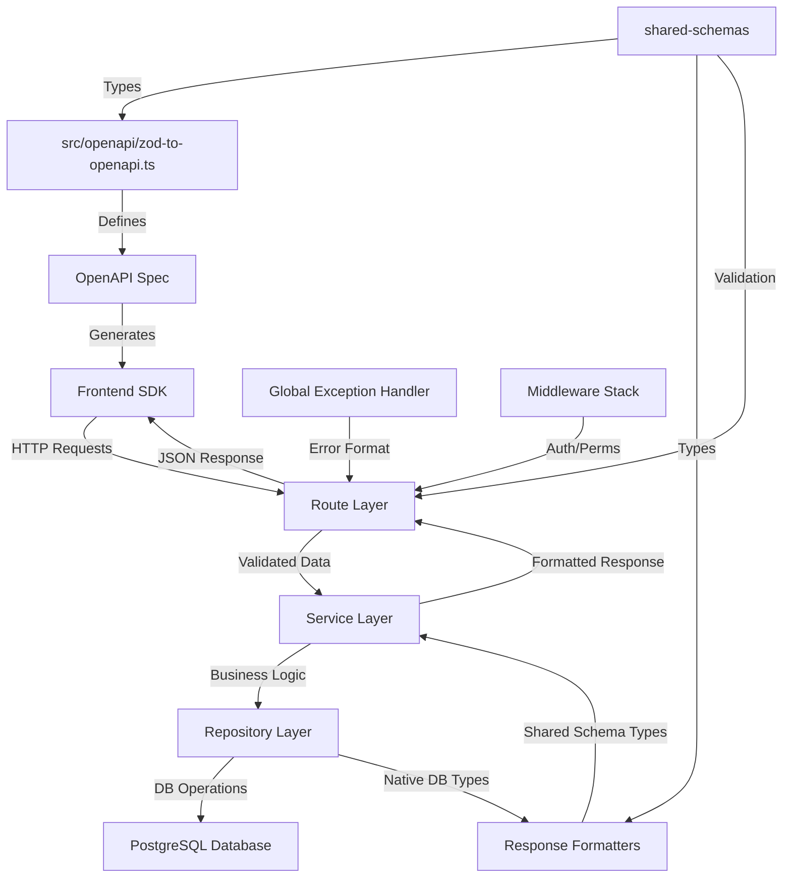
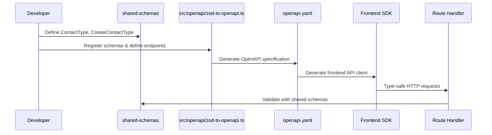
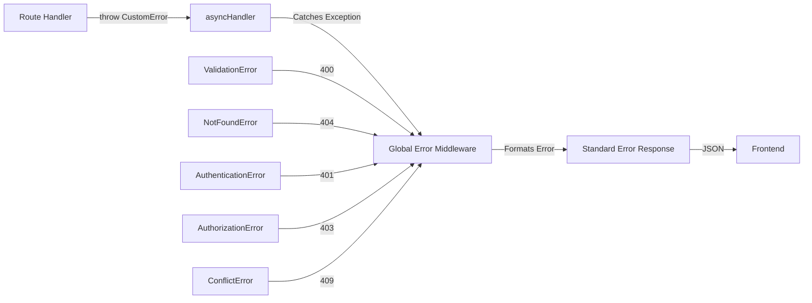
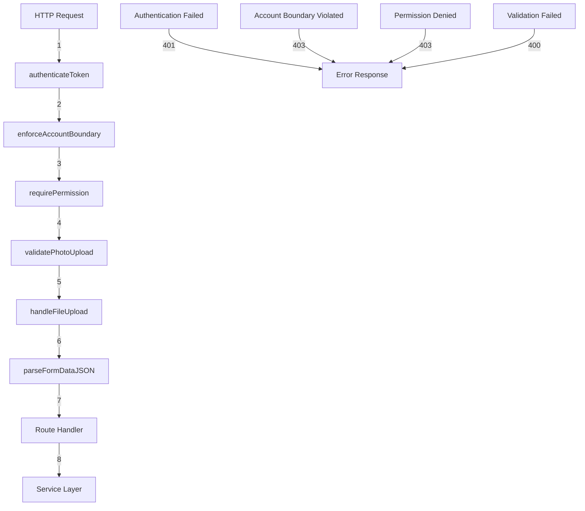
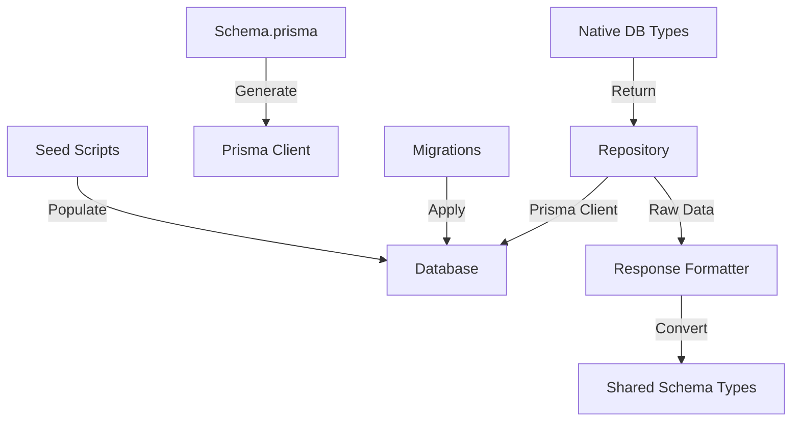
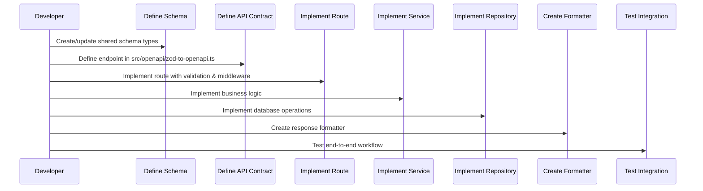

# Backend Architecture - Draco Sports Manager

## Overview

This document outlines the layered architecture patterns, principles, and best practices for the Draco Sports Manager backend built with Node.js, Express.js, TypeScript, Prisma ORM, and PostgreSQL. The backend follows a strict layered architecture that ensures type safety, security, and maintainability.

## Core Architectural Principles

### 1. Type Safety with Shared Schemas
- **All API contracts defined in OpenAPI** - Use `src/openapi/zod-to-openapi.ts` to define all route endpoints
- **Shared type system** - All request/response types come from `@draco/shared-schemas`
- **No dynamic types** - Always use proper TypeScript interfaces from shared schemas
- **Generated SDK** - OpenAPI specification generates frontend SDK automatically
- **Approval required for schema edits** - Files under `shared/shared-schemas` are restricted; obtain explicit approval before creating or modifying any shared schema definitions.
- **No ad-hoc Zod schemas** - Do not invent new Zod validators or ad-hoc type definitions in routes, services, or helpers. If a new shape is truly required, pause, obtain maintainer approval, and then add it via the shared schema workflow.

### 2. Layered Architecture
- **Route Layer** - Untrusted boundary handling validation, authentication, authorization
- **Service Layer** - Business logic that orchestrates repository operations
- **Repository Layer** - Database operations returning native DB types
- **Response Formatters** - Convert native DB types to shared schema types

### 3. Security-First Design
- **Untrusted Route Layer** - All permissions and validations happen at the route level
- **Account Boundary Enforcement** - Multi-tenant isolation enforced in middleware
- **Role-Based Access Control** - Hierarchical permission system
- **Service Layer Trust** - Services can assume data is validated and user is authorized

## Layered Architecture Overview



## Layer Responsibilities

### 1. Route Layer (`/routes`)

**Purpose**: Untrusted boundary that handles all validation, authentication, and authorization

**Responsibilities**:
- Parse and validate route parameters using `extractAccountParams()`, `extractContactParams()`
- Return shared data model types directly (e.g., `Account[]`), avoiding route-specific wrapper results
- Validate request body and query parameters with Zod schemas from shared-schemas
- Apply authentication middleware (`authenticateToken`)
- Enforce permissions (`routeProtection.requirePermission()`)
- Enforce account boundaries (`routeProtection.enforceAccountBoundary()`)
- Handle file uploads and multipart data
- Return shared schema types directly (no wrapper objects)
- Use `asyncHandler` for automatic exception handling

**Pattern**:
```typescript
router.post(
  '/:accountId/contacts',
  authenticateToken,
  routeProtection.enforceAccountBoundary(),
  routeProtection.requirePermission('account.contacts.manage'),
  validatePhotoUpload,
  handlePhotoUploadMiddleware,
  parseFormDataJSON,
  asyncHandler(async (req: Request, res: Response): Promise<void> => {
    const { accountId } = extractAccountParams(req.params);

    // Validate with shared schema
    const createContactData: CreateContactType = CreateContactSchema.parse(req.body);

    // Call service layer
    const contact: ContactType = await contactService.createContact(
      createContactData,
      BigInt(accountId),
    );

    // Return shared schema type directly
    res.status(201).json(contact);
  }),
);
```

### 2. Service Layer (`/services`)

**Purpose**: Business logic orchestration that coordinates repository operations

**Responsibilities**:
- Implement business rules and workflows
- Orchestrate multiple repository operations
- Handle business logic validation
- Use response formatters to convert DB types to shared schema types
- Assume data is validated and user is authorized (trust route layer)
- No direct database calls (use repository layer)

**Pattern**:
```typescript
export class ContactService {
  async createContact(
    contactData: CreateContactType,
    accountId: bigint
  ): Promise<ContactType> {
    // Business logic
    const processedData = this.processContactData(contactData);

    // Use repository for DB operations
    const dbContact = await this.contactRepository.create(processedData, accountId);

    // Use response formatter to convert to shared schema type
    return ContactResponseFormatter.format(dbContact);
  }

  async getContactRoster(contactId: bigint): Promise<RosterPlayerType | null> {
    const dbRoster = await this.rosterRepository.findByContactId(contactId);

    if (!dbRoster) {
      return null;
    }

    return RosterPlayerResponseFormatter.format(dbRoster);
  }
}
```

### 3. Repository Layer (`/repositories`)

**Purpose**: Database operations returning native DB types

**Responsibilities**:
- Encapsulate all database operations
- Organize repositories by domain (e.g., `AccountsRepository`) rather than per-endpoint variants
- Return native Prisma types
- Handle database-specific logic (transactions, complex queries)
- No knowledge of shared schema types
- No business logic

**Pattern**:
```typescript
export class ContactRepository {
  async create(
    contactData: ProcessedContactData,
    accountId: bigint
  ): Promise<PrismaContactWithIncludes> {
    return await prisma.contacts.create({
      data: {
        ...contactData,
        creatoraccountid: accountId,
      },
      include: {
        contactroles: {
          include: {
            roles: true,
          },
        },
      },
    });
  }

  async findById(contactId: bigint): Promise<PrismaContactWithIncludes | null> {
    return await prisma.contacts.findUnique({
      where: { id: contactId },
      include: {
        contactroles: {
          include: {
            roles: true,
          },
        },
      },
    });
  }
}
```

### 4. Response Formatters (`/formatters`)

**Purpose**: Convert native DB types to shared schema types

**Responsibilities**:
- Single responsibility: type conversion only
- Convert Prisma types to shared schema types
- Handle field name mapping (e.g., `firstname` → `firstName`)
- Format dates, transform IDs, etc.
- No business logic

**Pattern**:
```typescript
export class ContactResponseFormatter {
  static format(dbContact: PrismaContactWithIncludes): ContactType {
    return {
      id: dbContact.id.toString(),
      firstName: dbContact.firstname,
      lastName: dbContact.lastname,
      middleName: dbContact.middlename || undefined,
      email: dbContact.email || undefined,
      userId: dbContact.userid || undefined,
      photoUrl: dbContact.photourl || undefined,
      contactroles: dbContact.contactroles?.map(role => ({
        id: role.id.toString(),
        roleId: role.roleid,
        roleName: role.roles?.name,
        roleData: role.roledata.toString(),
        contextName: role.contextname || undefined,
      })),
      creatoraccountid: dbContact.creatoraccountid?.toString(),
    };
  }

  static formatMany(dbContacts: PrismaContactWithIncludes[]): ContactType[] {
    return dbContacts.map(contact => this.format(contact));
  }
}
```

## OpenAPI Integration

### API Contract Definition

All API endpoints are defined in `src/openapi/zod-to-openapi.ts` using shared schema types:



### Implementation Pattern:

```typescript
// In src/openapi/zod-to-openapi.ts
const ContactSchemaRef = registry.register('Contact', ContactSchema);
const CreateContactSchemaRef = registry.register('CreateContact', CreateContactSchema);

registry.registerPath({
  method: 'post',
  path: '/api/accounts/{accountId}/contacts',
  summary: 'Create a new contact',
  security: [{ bearerAuth: [] }],
  request: {
    params: z.object({
      accountId: z.string(),
    }),
    body: {
      content: {
        'application/json': {
          schema: CreateContactSchemaRef,
        },
      },
    },
  },
  responses: {
    201: {
      description: 'Contact created successfully',
      content: {
        'application/json': {
          schema: ContactSchemaRef,
        },
      },
    },
    400: {
      description: 'Validation error',
      content: {
        'application/json': {
          schema: ValidationErrorSchemaRef,
        },
      },
    },
  },
});
```

## Error Handling

### Global Exception Handler

The backend uses a global exception handler that automatically formats errors:



### Error Types from Shared Schemas:

```typescript
// Route handlers just throw - no try/catch needed
if (!contact) {
  throw new NotFoundError('Contact not found');
}

if (duplicateEmail) {
  throw new ConflictError('Email already exists');
}

// Global handler formats to:
// {
//   "error": "NotFound",
//   "message": "Contact not found",
//   "statusCode": 404
// }
```

## Middleware Stack

### Security Middleware Pipeline



### Middleware Responsibilities:

1. **authenticateToken**: Validate JWT, populate `req.user`
2. **enforceAccountBoundary**: Ensure user belongs to the account in URL
3. **requirePermission**: Check user has required permission for operation
4. **validatePhotoUpload**: Validate file upload parameters
5. **handleFileUpload**: Process multipart file uploads
6. **parseFormDataJSON**: Parse JSON from multipart form data

## Database Layer

### Prisma Integration



### Database Patterns:

- **Repositories** use Prisma Client directly
- **Include relationships** as needed for response formatting
- **BigInt IDs** converted to strings in formatters
- **Nullable fields** handled appropriately in formatters
- **Complex queries** encapsulated in repository methods

## Development Workflow

### 1. API Development Process



### 2. Implementation Checklist

**For each new endpoint:**

1. ✅ **Define Schema Types** - Add to `@draco/shared-schemas`
2. ✅ **Register in OpenAPI** - Add to `src/openapi/zod-to-openapi.ts`
3. ✅ **Implement Route** - Use proper middleware stack
4. ✅ **Create Service Method** - Business logic orchestration
5. ✅ **Create Repository Method** - Database operations
6. ✅ **Create Response Formatter** - Type conversion
7. ✅ **Test Integration** - Verify end-to-end flow

## Best Practices

### 1. Route Layer
- **Always use asyncHandler** - Automatic exception handling
- **Validate everything** - Parameters, body, query string
- **Apply security middleware** - Authentication, authorization, account boundary
- **Return shared types directly** - No wrapper objects
- **Use parameter extractors** - `extractAccountParams()`, `extractContactParams()`

### 2. Service Layer
- **Single responsibility** - Each service handles one domain
- **Orchestrate repositories** - Coordinate multiple data operations
- **Business logic only** - No database calls, no validation
- **Use formatters** - Convert all DB types to shared schema types
- **Handle business rules** - Implement domain-specific logic

### 3. Repository Layer
- **Database operations only** - No business logic
- **Return native types** - Prisma types, not shared schema types
- **Use transactions** - For complex multi-table operations
- **Include relationships** - As needed for response formatting
- **Handle errors gracefully** - Let Prisma errors bubble up

### 4. Response Formatters
- **Single purpose** - Type conversion only
- **Static methods** - Pure functions for conversion
- **Handle nulls properly** - Convert to undefined as needed
- **Transform IDs** - BigInt to string conversion
- **Format dates** - Consistent date formatting

## Example: Complete End-to-End Flow

### GET /api/accounts/:accountId/contacts/:contactId/roster

**1. OpenAPI Definition:**
```typescript
registry.registerPath({
  method: 'get',
  path: '/api/accounts/{accountId}/contacts/{contactId}/roster',
  responses: {
    200: {
      content: {
        'application/json': {
          schema: RosterPlayerSchemaRef,
        },
      },
    },
  },
});
```

**2. Route Implementation:**
```typescript
router.get(
  '/:accountId/contacts/:contactId/roster',
  asyncHandler(async (req: Request, res: Response): Promise<void> => {
    const { contactId } = extractContactParams(req.params);

    const roster = await contactService.getContactRoster(BigInt(contactId));

    if (!roster) {
      throw new NotFoundError('Roster not found');
    }

    res.json(roster);
  }),
);
```

**3. Service Implementation:**
```typescript
async getContactRoster(contactId: bigint): Promise<RosterPlayerType | null> {
  const dbRoster = await this.rosterRepository.findByContactId(contactId);

  if (!dbRoster) {
    return null;
  }

  return RosterPlayerResponseFormatter.format(dbRoster);
}
```

**4. Repository Implementation:**
```typescript
async findByContactId(contactId: bigint): Promise<PrismaRosterWithContact | null> {
  return await prisma.roster.findFirst({
    where: { contactid: contactId },
    include: {
      contacts: {
        select: {
          firstname: true,
          lastname: true,
        },
      },
    },
  });
}
```

**5. Response Formatter:**
```typescript
static format(dbRoster: PrismaRosterWithContact): RosterPlayerType {
  return {
    id: dbRoster.id.toString(),
    contactId: dbRoster.contactid.toString(),
    submittedDriversLicense: dbRoster.submitteddriverslicense,
    firstYear: dbRoster.firstyear,
    contact: {
      id: dbRoster.contactid.toString(),
      firstName: dbRoster.contacts.firstname,
      lastName: dbRoster.contacts.lastname,
    },
  };
}
```

## Anti-Patterns to Avoid

### ❌ Don't Do This:

```typescript
// Route with business logic
router.post('/contacts', async (req, res) => {
  // ❌ Direct DB calls in route
  const contact = await prisma.contacts.create({...});

  // ❌ Manual response wrapping
  res.json({ success: true, data: contact });
});

// Service with database calls
class ContactService {
  async createContact() {
    // ❌ Direct DB calls in service
    return await prisma.contacts.create({...});
  }
}

// Mixed type handling
function formatContact(dbContact: any) {
  // ❌ Any types and mixed responsibilities
  return {
    ...dbContact,
    success: true, // ❌ Adding wrapper fields
  };
}
```

### ✅ Do This Instead:

```typescript
// Clean route
router.post('/contacts',
  authenticateToken,
  routeProtection.enforceAccountBoundary(),
  routeProtection.requirePermission('account.contacts.manage'),
  asyncHandler(async (req: Request, res: Response): Promise<void> => {
    const { accountId } = extractAccountParams(req.params);
    const createContactData: CreateContactType = CreateContactSchema.parse(req.body);

    const contact: ContactType = await contactService.createContact(
      createContactData,
      BigInt(accountId),
    );

    res.status(201).json(contact);
  }),
);

// Clean service
class ContactService {
  async createContact(
    contactData: CreateContactType,
    accountId: bigint
  ): Promise<ContactType> {
    const dbContact = await this.contactRepository.create(contactData, accountId);
    return ContactResponseFormatter.format(dbContact);
  }
}

// Clean formatter
class ContactResponseFormatter {
  static format(dbContact: PrismaContactType): ContactType {
    return {
      id: dbContact.id.toString(),
      firstName: dbContact.firstname,
      lastName: dbContact.lastname,
      // ... proper type conversion
    };
  }
}
```

## Future Enhancements

### Planned Improvements
1. **Repository Interface Standardization** - Common patterns for all repositories
2. **Service Interface Contracts** - Standardized service method signatures
3. **Response Formatter Base Classes** - Common formatting utilities
4. **Automated API Testing** - Contract testing with OpenAPI specs
5. **Performance Monitoring** - Request/response timing and database query optimization

### Architecture Evolution
- **Microservices** - Split services by domain boundaries
- **Event-Driven Architecture** - Async processing with message queues
- **CQRS Pattern** - Separate read/write models for complex domains
- **Domain-Driven Design** - Refactor services around business domains

## Email Provider Configuration

Outbound email is abstracted behind `EmailConfigFactory` and the provider classes in
`src/services/email/providers`. The factory picks a transport using the `EMAIL_PROVIDER`
environment variable:

- **Production (Railway)** defaults to AWS SES (`EMAIL_PROVIDER=ses`).
- **Local development/tests** default to Ethereal (`EMAIL_PROVIDER=ethereal`).
- Any environment can override the default by exporting `EMAIL_PROVIDER=ses | sendgrid | ethereal`
  before starting the backend.

### Shared environment variables

| Variable | Purpose |
| --- | --- |
| `EMAIL_FROM` | Sender email stamped on every message (required). |
| `EMAIL_FROM_NAME` | Display name paired with `EMAIL_FROM` (required). |
| `EMAIL_REPLY_TO` | Optional global reply-to fallback; individual jobs may override it. |
| `BASE_URL` | Public site URL used when generating links inside templates. |

These values are read once at boot, so update Railway variables and redeploy after changes.

### AWS SES (default production provider)

```
EMAIL_PROVIDER=ses
SES_SMTP_USER=<IAM SMTP username>
SES_SMTP_PASS=<IAM SMTP password>
SES_REGION=<aws-region>            # e.g., us-east-1 (or set SES_SMTP_HOST instead)
SES_SMTP_HOST=email-smtp.<region>.amazonaws.com  # optional explicit host override
SES_SMTP_PORT=587                  # optional, defaults to 587; set 465 for TLS-only
```

- Supply either `SES_REGION` or `SES_SMTP_HOST` so the factory can derive the SMTP endpoint.
- Sandbox mode only delivers to verified identities—keep verifying sender/recipient inboxes until
  you request production access.

### SendGrid

```
EMAIL_PROVIDER=sendgrid
SENDGRID_API_KEY=<restricted API key>
SENDGRID_WEBHOOK_PUBLIC_KEY=<optional, required only for signed event webhooks>
```

- These settings remain available for legacy deployments that still require SendGrid.

### Ethereal (local testing)

```
EMAIL_PROVIDER=ethereal
EMAIL_DEV_USER=<optional test inbox user>
EMAIL_DEV_PASS=<optional test inbox password>
EMAIL_DEV_HOST=smtp.ethereal.email   # optional override
```

- When `EMAIL_DEV_USER`/`EMAIL_DEV_PASS` are omitted the provider provisions a throwaway inbox at
  runtime so developers can inspect preview URLs.

Restart the backend when any of these variables change so the provider factory rebuilds the Nodemailer
transporter with the new credentials.

## Tools and Libraries

### Core Technologies
- **Node.js & Express.js** - Runtime and web framework
- **TypeScript** - Type safety and development experience
- **Prisma ORM** - Database operations and migrations
- **PostgreSQL** - Primary database
- **Zod** - Schema validation and type generation

### Development Tools
- **zod-to-openapi** - API specification generation
- **ESLint & Prettier** - Code quality and formatting
- **Vitest** - Unit and integration testing
- **tsx** - TypeScript execution for development

### Authentication & Security
- **jsonwebtoken** - JWT token handling
- **bcrypt** - Password hashing
- **multer** - File upload handling
- **helmet** - Security headers

## Migration Guidelines

When refactoring existing code to follow this architecture:

1. **Extract Response Formatters** - Move type conversion logic to dedicated formatters
2. **Create Repository Layer** - Move database calls from services to repositories
3. **Clean Route Handlers** - Remove business logic, add proper validation
4. **Define OpenAPI Contracts** - Add endpoint definitions to src/openapi/zod-to-openapi.ts
5. **Update Service Layer** - Focus on business logic orchestration only
6. **Add Proper Error Handling** - Use custom error types and asyncHandler
7. **Test Integration** - Verify end-to-end data flow works correctly
