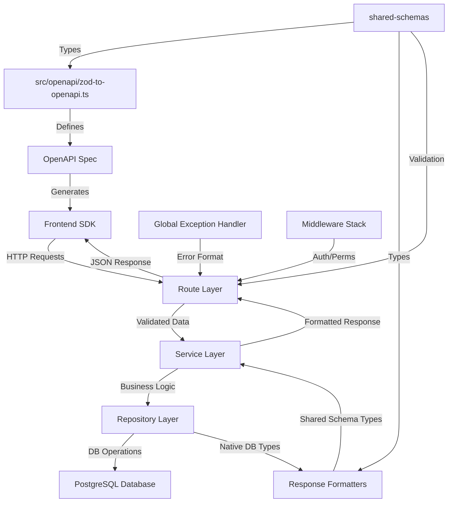
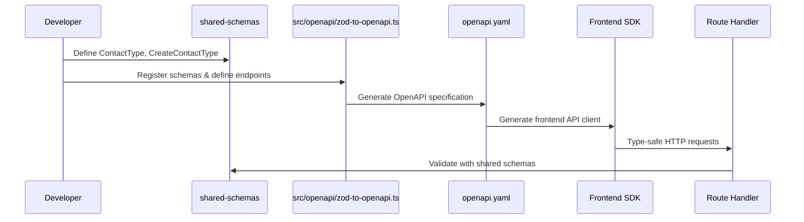
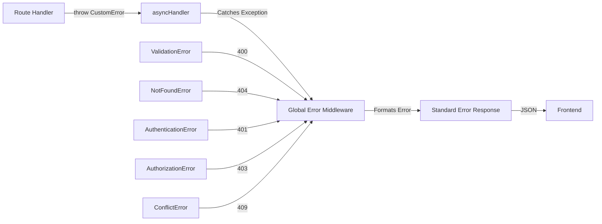
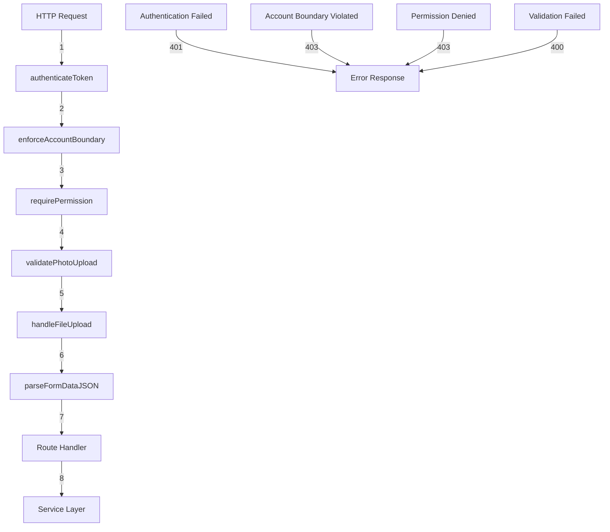
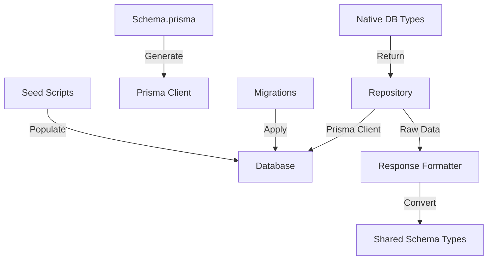
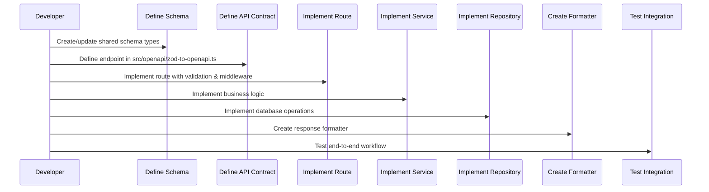

# Backend Reference - Draco Sports Manager

This document contains detailed examples, diagrams, tools, and deployment configurations for the Draco Sports Manager backend. For essential patterns and rules, see [CLAUDE.md](./CLAUDE.md).

## Table of Contents
1. [Architecture Diagrams](#architecture-diagrams)
2. [Complete End-to-End Flow Example](#complete-end-to-end-flow-example)
3. [Email Provider Configuration](#email-provider-configuration)
4. [Tools and Libraries](#tools-and-libraries)
5. [Migration Guidelines](#migration-guidelines)
6. [Future Enhancements](#future-enhancements)

---

## Architecture Diagrams

### Layered Architecture Overview



### OpenAPI Integration Flow



### Error Handling Flow



### Middleware Security Pipeline



### Prisma Integration



### API Development Process



---

## Complete End-to-End Flow Example

### GET /api/accounts/:accountId/contacts/:contactId/roster

This example demonstrates all layers working together for a single endpoint.

**1. OpenAPI Definition:**
```typescript
// In src/openapi/zod-to-openapi.ts
registry.registerPath({
  method: 'get',
  path: '/api/accounts/{accountId}/contacts/{contactId}/roster',
  summary: 'Get roster information for a contact',
  security: [{ bearerAuth: [] }],
  request: {
    params: z.object({
      accountId: z.string(),
      contactId: z.string(),
    }),
  },
  responses: {
    200: {
      description: 'Roster information retrieved successfully',
      content: {
        'application/json': {
          schema: RosterPlayerSchemaRef,
        },
      },
    },
    404: {
      description: 'Roster not found',
      content: {
        'application/json': {
          schema: ErrorSchemaRef,
        },
      },
    },
  },
});
```

**2. Route Implementation:**
```typescript
// In src/routes/contacts.ts
router.get(
  '/:accountId/contacts/:contactId/roster',
  authenticateToken,
  routeProtection.enforceAccountBoundary(),
  routeProtection.requirePermission('account.contacts.view'),
  asyncHandler(async (req: Request, res: Response): Promise<void> => {
    const { contactId } = extractContactParams(req.params);

    const roster = await contactService.getContactRoster(BigInt(contactId));

    if (!roster) {
      throw new NotFoundError('Roster not found for this contact');
    }

    res.json(roster);
  }),
);
```

**3. Service Implementation:**
```typescript
// In src/services/ContactService.ts
export class ContactService {
  private rosterRepository: IRosterRepository;

  constructor() {
    this.rosterRepository = RepositoryFactory.getRosterRepository();
  }

  async getContactRoster(contactId: bigint): Promise<RosterPlayerType | null> {
    const dbRoster = await this.rosterRepository.findByContactId(contactId);

    if (!dbRoster) {
      return null;
    }

    return RosterPlayerResponseFormatter.format(dbRoster);
  }
}
```

**4. Repository Implementation:**
```typescript
// In src/repositories/implementations/PrismaRosterRepository.ts
export class PrismaRosterRepository implements IRosterRepository {
  async findByContactId(contactId: bigint): Promise<PrismaRosterWithContact | null> {
    return await prisma.roster.findFirst({
      where: { contactid: contactId },
      include: {
        contacts: {
          select: {
            firstname: true,
            lastname: true,
            middlename: true,
            email: true,
            photourl: true,
          },
        },
      },
    });
  }
}
```

**5. Response Formatter:**
```typescript
// In src/responseFormatters/rosterPlayerResponseFormatter.ts
export class RosterPlayerResponseFormatter {
  static format(dbRoster: PrismaRosterWithContact): RosterPlayerType {
    return {
      id: dbRoster.id.toString(),
      contactId: dbRoster.contactid.toString(),
      submittedDriversLicense: dbRoster.submitteddriverslicense,
      firstYear: dbRoster.firstyear,
      contact: {
        id: dbRoster.contactid.toString(),
        firstName: dbRoster.contacts.firstname,
        lastName: dbRoster.contacts.lastname,
        middleName: dbRoster.contacts.middlename || undefined,
        email: dbRoster.contacts.email || undefined,
        photoUrl: dbRoster.contacts.photourl || undefined,
      },
    };
  }

  static formatMany(dbRosters: PrismaRosterWithContact[]): RosterPlayerType[] {
    return dbRosters.map(roster => this.format(roster));
  }
}
```

**6. Type Definitions:**
```typescript
// In repositories/types/dbTypes.ts
export type PrismaRosterWithContact = Prisma.rosterGetPayload<{
  include: {
    contacts: {
      select: {
        firstname: true;
        lastname: true;
        middlename: true;
        email: true;
        photourl: true;
      };
    };
  };
}>;
```

---

## Email Provider Configuration

Outbound email is abstracted behind `EmailConfigFactory` and the provider classes in
`src/services/email/providers`. The factory picks a transport using the `EMAIL_PROVIDER`
environment variable.

### Environment Setup

- **Production (Railway)** defaults to AWS SES (`EMAIL_PROVIDER=ses`).
- **Local development/tests** default to Ethereal (`EMAIL_PROVIDER=ethereal`).
- Any environment can override the default by setting `EMAIL_PROVIDER` to one of: `ses`, `sendgrid`, `resend`, `ethereal`, or `none` before starting the backend.

### Shared Environment Variables

| Variable | Purpose |
| --- | --- |
| `EMAIL_FROM` | Sender email stamped on every message. **Required** – the application will fail to start if not set. |
| `EMAIL_FROM_NAME` | Display name paired with `EMAIL_FROM`. Defaults to `ezRecSports` if not set. |
| `EMAIL_REPLY_TO` | Optional global reply-to fallback; individual jobs may override it. |
| `BASE_URL` | Public site URL used when generating links inside templates. |

These values are read once at boot, so update Railway variables and redeploy after changes.

### AWS SES (default production provider)

```bash
EMAIL_PROVIDER=ses
SES_SMTP_USER=<IAM SMTP username>
SES_SMTP_PASS=<IAM SMTP password>
SES_REGION=<aws-region>            # e.g., us-east-1 (or set SES_SMTP_HOST instead)
SES_SMTP_HOST=email-smtp.us-east-1.amazonaws.com  # optional explicit host override
SES_SMTP_PORT=587                  # optional, defaults to 587; set 465 for TLS-only
```

**Notes:**
- Supply either `SES_REGION` or `SES_SMTP_HOST` so the factory can derive the SMTP endpoint.
- Sandbox mode only delivers to verified identities—keep verifying sender/recipient inboxes until you request production access.

### SendGrid

```bash
EMAIL_PROVIDER=sendgrid
SENDGRID_API_KEY=<restricted API key>
SENDGRID_WEBHOOK_PUBLIC_KEY=<optional, required only for signed event webhooks>
```

These settings remain available for legacy deployments that still require SendGrid.

### Resend

```bash
EMAIL_PROVIDER=resend
RESEND_API_KEY=<production API key>
RESEND_WEBHOOK_SECRET=<svix signing secret for webhook verification>
```

**Notes:**
- Configure verified senders/domains in Resend before enabling production sends.
- When using webhooks, supply `RESEND_WEBHOOK_SECRET` so the backend can verify signatures.

### None (email disabled)

```bash
EMAIL_PROVIDER=none
```

No outbound email is attempted; payloads are logged for debugging only. Useful for accounts that elect to manage communications outside the platform.

### Ethereal (local testing)

```bash
EMAIL_PROVIDER=ethereal
EMAIL_DEV_USER=<optional test inbox user>
EMAIL_DEV_PASS=<optional test inbox password>
EMAIL_DEV_HOST=smtp.ethereal.email   # optional override
```

When `EMAIL_DEV_USER`/`EMAIL_DEV_PASS` are omitted the provider provisions a throwaway inbox at runtime so developers can inspect preview URLs.

**Important:** Restart the backend when any of these variables change so the provider factory rebuilds the Nodemailer transporter with the new credentials.

---

## Tools and Libraries

### Core Technologies
- **Node.js & Express.js** - Runtime and web framework
- **TypeScript** - Type safety and development experience
- **Prisma ORM** - Database operations and migrations
- **PostgreSQL** - Primary database
- **Zod** - Schema validation and type generation

### Development Tools
- **zod-to-openapi** - API specification generation
- **ESLint & Prettier** - Code quality and formatting
- **Vitest** - Unit and integration testing
- **tsx** - TypeScript execution for development

### Authentication & Security
- **jsonwebtoken** - JWT token handling
- **bcrypt** - Password hashing
- **multer** - File upload handling
- **helmet** - Security headers
- **cors** - Cross-origin resource sharing

### Email & Communications
- **Nodemailer** - Email sending functionality
- **AWS SES SDK** - Production email delivery
- **SendGrid** - Alternative email provider
- **Resend** - Modern email API

### Storage & File Management
- **AWS S3 SDK** - Cloud storage for media files
- **Sharp** - Image processing and optimization
- **LocalStack** - Local AWS service emulation

---

## Migration Guidelines

When refactoring existing code to follow this architecture:

1. **Extract Response Formatters**
   - Move type conversion logic to dedicated formatters
   - Create static `format()` and `formatMany()` methods
   - Handle field name mapping (database → API format)
   - Transform IDs (BigInt → string)

2. **Create Repository Layer**
   - Move database calls from services to repositories
   - Define interfaces in `/repositories/interfaces`
   - Implement in `/repositories/implementations`
   - Return native Prisma types only

3. **Clean Route Handlers**
   - Remove business logic
   - Add proper validation with Zod schemas
   - Apply authentication and authorization middleware
   - Use `asyncHandler` for error handling

4. **Define OpenAPI Contracts**
   - Add endpoint definitions to `src/openapi/zod-to-openapi.ts`
   - Register request/response schemas
   - Generate frontend SDK with `npm run sync:api`

5. **Update Service Layer**
   - Focus on business logic orchestration only
   - Use RepositoryFactory to get repositories
   - Use response formatters for type conversion
   - No direct database calls

6. **Add Proper Error Handling**
   - Use custom error types (`NotFoundError`, `ConflictError`, etc.)
   - Let asyncHandler catch and format errors
   - Avoid try/catch in route handlers

7. **Test Integration**
   - Verify end-to-end data flow works correctly
   - Update tests to use new layer structure
   - Test with real database using Prisma

---

## Future Enhancements

### Planned Improvements
1. **Repository Interface Standardization** - Common patterns for all repositories
2. **Service Interface Contracts** - Standardized service method signatures
3. **Response Formatter Base Classes** - Common formatting utilities
4. **Automated API Testing** - Contract testing with OpenAPI specs
5. **Performance Monitoring** - Request/response timing and database query optimization

### Architecture Evolution
- **Microservices** - Split services by domain boundaries
- **Event-Driven Architecture** - Async processing with message queues
- **CQRS Pattern** - Separate read/write models for complex domains
- **Domain-Driven Design** - Refactor services around business domains
- **GraphQL Gateway** - Optional GraphQL layer on top of REST APIs
- **Caching Layer** - Redis for frequently accessed data
