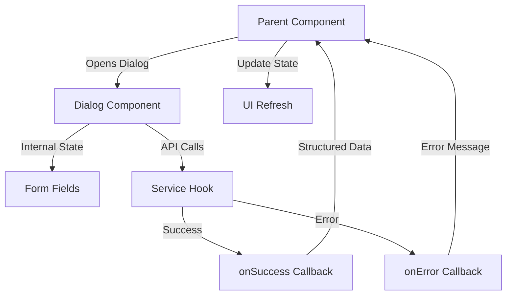
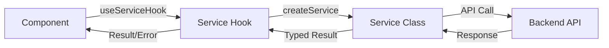
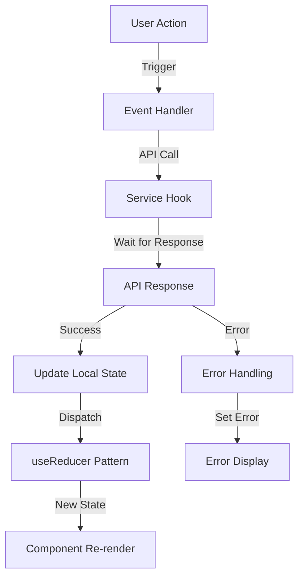
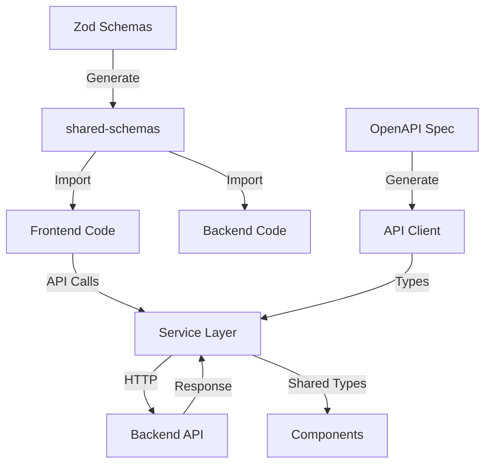
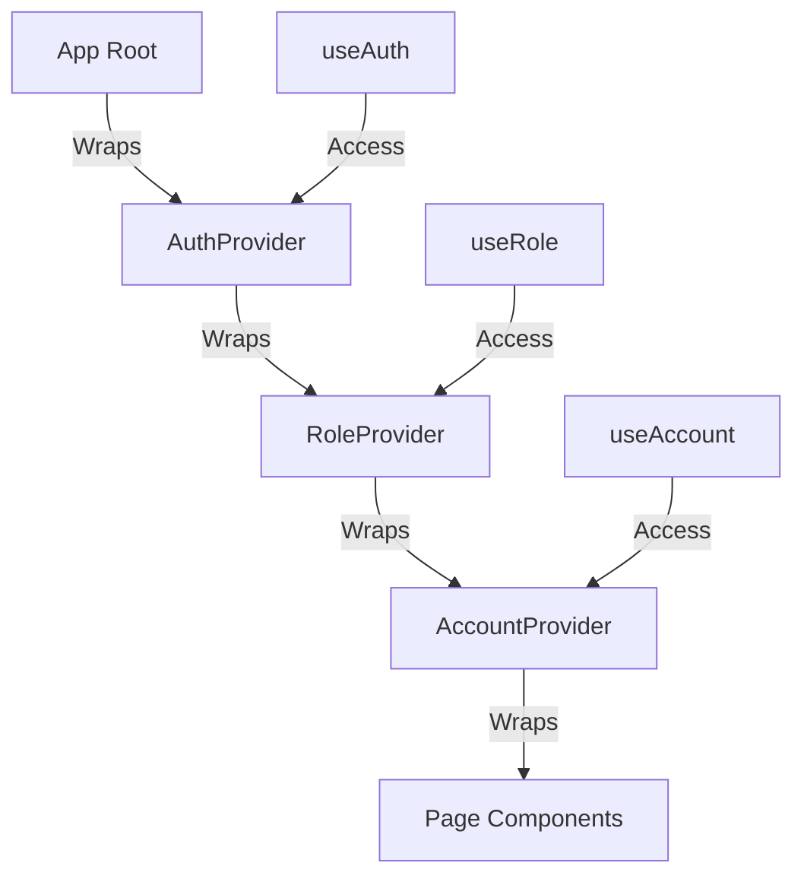
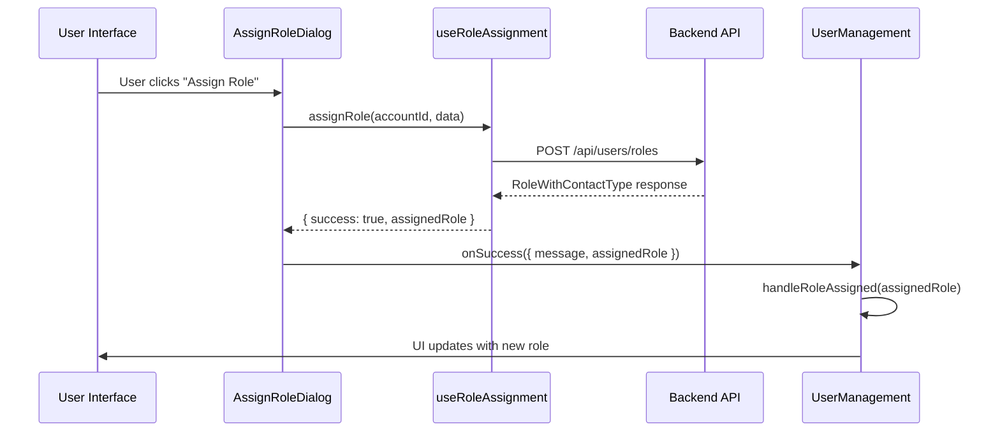

# Frontend Architecture - Draco Sports Manager

## Overview

This document outlines the architectural patterns, principles, and best practices for the Draco Sports Manager frontend built with Next.js 15 (App Router), React 19, TypeScript, and Material-UI 7.

## Core Architectural Principles

### 1. Type Safety First
- **NEVER use dynamic types for backend/frontend data exchange** - Always use proper TypeScript interfaces from shared schemas
- **Use shared schemas** - All backend/frontend data types must come from `@draco/shared-schemas`
- **Strong typing everywhere** - While critical for API data exchange, strive for strong types throughout the application
- **Maintain type consistency** - Backend and frontend must use identical type definitions

### 2. Self-Contained Components
- **Dialogs manage their own state** - Internal form state, validation, and API calls
- **Event-based communication** - Use callbacks (`onSuccess`, `onError`) for parent communication
- **Return structured data** - Always return properly typed results back to parent components

### 3. Real Data Updates
- **No page reloads** - Use state updates to reflect changes immediately
- **Wait for API results** - Always wait for real API responses before updating UI
- **Consistent state management** - Use established patterns (useReducer, dispatch)

## Project Structure

```
frontend-next/
├── app/                    # Next.js App Router pages
├── components/             # Reusable UI components
├── context/               # React contexts (Auth, Role, Account)
├── hooks/                 # Custom React hooks
├── services/              # API service layer
├── types/                 # TypeScript type definitions
├── utils/                 # Helper functions
└── FRONTEND_ARCHITECTURE.md
```

## Architecture Patterns

### Dialog Management Pattern

#### Overview
Dialogs follow a self-contained architecture pattern where each dialog manages its own state, API calls, and validation while communicating with parent components through event callbacks.



#### Implementation Pattern

**1. Dialog Component Structure:**
```typescript
interface DialogProps {
  open: boolean;
  onClose: () => void;
  onSuccess?: (result: { message: string; data: TypedResult }) => void;
  onError?: (error: string) => void;
  // Context data props
  contextData?: ContextType[];
  loading?: boolean;
}

const Dialog: React.FC<DialogProps> = ({
  open,
  onClose,
  onSuccess,
  onError,
  contextData
}) => {
  // Internal state management
  const [formField1, setFormField1] = useState('');
  const [formField2, setFormField2] = useState('');

  // Service hook for API operations
  const { performOperation, loading } = useOperationHook(accountId);

  // Handle form submission
  const handleSubmit = useCallback(async () => {
    const result = await performOperation({
      field1: formField1,
      field2: formField2,
    });

    if (result.success) {
      onSuccess?.({
        message: result.message,
        data: result.data // Properly typed from shared schemas
      });
      onClose();
    } else {
      onError?.(result.error);
    }
  }, [formField1, formField2, performOperation, onSuccess, onError, onClose]);

  return (
    <Dialog open={open} onClose={onClose}>
      {/* Form content with internal state */}
    </Dialog>
  );
};
```

**2. Parent Component Integration:**
```typescript
const ParentComponent = () => {
  const dialogs = useDialogManager();

  const handleDialogSuccess = useCallback((result: { message: string; data: TypedResult }) => {
    setSuccess(result.message);
    updateStateIncrementally(result.data); // Use existing dispatch patterns
    dialogs.dialog.close();
  }, [updateStateIncrementally, dialogs.dialog]);

  return (
    <>
      <Dialog
        open={dialogs.dialog.isOpen}
        onClose={dialogs.dialog.close}
        onSuccess={handleDialogSuccess}
        onError={setError}
        contextData={contextData}
      />
    </>
  );
};
```

### Form Validation Pattern

- **Rely on shared Zod schemas**: import definitions from `@draco/shared-schemas` so frontend validation always matches backend expectations.
- **Pair schemas with React Hook Form**: initialize `useForm` with `zodResolver` to wire synchronous validation and typed form values.
- **Extend schemas for UI-only fields** (e.g., uploads) instead of redefining validation rules inline.
- **Reference implementations**: `components/users/EditContactDialog.tsx` and `components/sponsors/SponsorFormDialog.tsx` show the dialog pattern.

```typescript
import { z } from 'zod';
import { SharedSchema } from '@draco/shared-schemas';
import { zodResolver } from '@hookform/resolvers/zod';
import { useForm } from 'react-hook-form';

const FormSchema = SharedSchema.extend({
  photo: z.any().optional().nullable(),
});

const {
  register,
  handleSubmit,
  reset,
  formState: { errors, isSubmitting },
} = useForm<z.infer<typeof FormSchema>>({
  resolver: zodResolver(FormSchema),
  defaultValues,
});

const onSubmit = handleSubmit(async (values) => {
  const payload = transform(values);
  await serviceOperation(payload);
  onSuccess?.();
});

return (
  <TextField
    {...register('name')}
    error={Boolean(errors.name)}
    helperText={errors.name?.message}
  />
);
```

When the dialog opens for editing, call `reset` with the existing entity inside an effect. Always clear backend error state on close so reopen flows start cleanly.

### Service Hook Pattern

Service hooks encapsulate API operations and provide consistent error handling across components.



#### Implementation:
```typescript
export function useServiceHook(accountId: string) {
  const [loading, setLoading] = useState(false);
  const { token } = useAuth();
  const { currentSeasonId } = useCurrentSeason(accountId);
  const service = token ? createService(token) : null;

  const performOperation = useCallback(async (
    data: OperationData
  ): Promise<OperationResult> => {
    if (!service) {
      return { success: false, error: 'Service not available' };
    }

    try {
      setLoading(true);

      const result = await service.operation(accountId, data, currentSeasonId);

      return {
        success: true,
        message: 'Operation successful',
        data: result // Typed from shared schemas
      };
    } catch (err) {
      console.error('Operation error:', err);
      const errorMessage = err instanceof Error ? err.message : 'Operation failed';
      return { success: false, error: errorMessage };
    } finally {
      setLoading(false);
    }
  }, [service, accountId, currentSeasonId]);

  return { performOperation, loading };
}
```

### OpenAPI Client Integration

Generated operations from `@draco/shared-api-client` expect a configured HTTP client. Always hydrate them with the shared instance returned from `useApiClient`, which wraps `createClient`/`createConfig` and injects the active auth token.

```typescript
const apiClient = useApiClient();

const result = await apiGetContactRoster({
  path: { accountId, contactId },
  client: apiClient,
  throwOnError: false,
});
const roster = unwrapApiResult(result, 'Failed to load contact roster');
```

Leaving out the `client` parameter causes the generated helper to throw because it has no transport configuration. Keep the `client: apiClient` field in every OpenAPI call (for example `apiUpdateRosterMember({...})` in `useRosterDataManager`) so requests inherit the authenticated base configuration.

Wrap responses with the shared helpers in `utils/apiResult.ts` to centralize error handling:

```typescript
import { unwrapApiResult, assertNoApiError } from '@/utils/apiResult';

const data = unwrapApiResult(result, 'Failed to load');
assertNoApiError(deleteResult, 'Failed to delete record');
```

### Account & Team Page Layout Pattern

Account-scoped and team-scoped management pages must wrap their content with a semantic `<main>` element immediately followed by `AccountPageHeader`. The header renders the shared hero gradient and ensures consistent breadcrumb spacing for downstream sections.

```tsx
return (
  <main className="min-h-screen bg-background">
    <AccountPageHeader accountId={accountId}>
      {/* Header content */}
    </AccountPageHeader>

    <Container>{/* Page body */}</Container>
  </main>
);
```

### Metadata Generation Pattern

Every account or team page must export `generateMetadata` so tab titles, favicons, canonical URLs, and crawler directives stay in sync with the active organization. Always delegate to `buildSeoMetadata` from `lib/seoMetadata`—it normalizes canonical paths, merges default keywords, and falls back to the house favicon when an account icon is missing.

```tsx
import { getTeamInfo } from '../../../../lib/metadataFetchers';
import { buildSeoMetadata } from '../../../../lib/seoMetadata';

export async function generateMetadata({
  params,
}: {
  params: Promise<{ accountId: string; seasonId: string; teamSeasonId: string }>;
}) {
  const { accountId, seasonId, teamSeasonId } = await params;
  const { account, league, team, iconUrl } = await getTeamInfo(accountId, seasonId, teamSeasonId);

  return buildSeoMetadata({
    title: `${team} Sponsors | ${account}`,
    description: `Manage sponsor placements for ${team} in the ${league} league under ${account}.`,
    path: `/account/${accountId}/seasons/${seasonId}/teams/${teamSeasonId}/sponsors/manage`,
    icon: iconUrl,
    index: false,
  });
}
```

For account-level pages, call `getAccountBranding(accountId)` instead. When you pass `icon: iconUrl`, the helper will automatically substitute the default favicon if the account branding omits one. Always craft human-readable descriptions so shared links get meaningful previews.

### Dialog Implementation Reference

Reusable dialogs such as `SponsorFormDialog` live in `components/` and embed the service-hook pattern described above. They accept `onSuccess`/`onError` callbacks, manage internal form state, and reset their local state when closed. Parent pages open the dialog, handle callbacks, and refresh their local caches.

### State Management Pattern

Use consistent state management patterns throughout the application.



#### Real Data Updates:
```typescript
const handleDataUpdated = useCallback((updatedData: TypedData) => {
  // Only update state after receiving real API response
  const updatedItems = state.items.map(item => {
    if (item.id === updatedData.id) {
      return {
        ...item,
        ...updatedData, // Merge updated fields from API response
      };
    }
    return item;
  });

  // Use existing dispatch pattern
  dispatch({
    type: 'SET_DATA',
    items: updatedItems,
    hasNext: state.hasNext,
    hasPrev: state.hasPrev,
    page: state.page,
  });
}, [state, dispatch]);
```

## Component Categories

### 1. Page Components (`/app`)
- **Purpose**: Top-level route components
- **Responsibilities**: Layout, data fetching, route protection
- **Pattern**: Use page-level hooks for data management

### 2. Feature Components (`/components`)
- **Purpose**: Reusable business logic components
- **Responsibilities**: Feature-specific UI and logic
- **Pattern**: Self-contained with clear prop interfaces

### 3. Dialog Components (`/components/*/dialogs`)
- **Purpose**: Modal interactions for data operations
- **Responsibilities**: Form handling, validation, API calls
- **Pattern**: Self-contained with event-based communication

### 4. Service Hooks (`/hooks`)
- **Purpose**: Encapsulate API operations
- **Responsibilities**: Data fetching, error handling, loading states
- **Pattern**: Return typed results with consistent error handling

## Type System Architecture

### Shared Schema Integration



### Type Usage Rules:

1. **Import from shared schemas:**
```typescript
import { ContactType, RoleWithContactType } from '@draco/shared-schemas';
```

2. **Never create duplicate types:**
```typescript
// ❌ Don't do this
interface User {
  id: string;
  name: string;
}

// ✅ Do this
import { ContactType } from '@draco/shared-schemas';
```

3. **Extend shared types when needed:**
```typescript
interface EnhancedContact extends ContactType {
  displayName: string;
  roleCount: number;
}
```

## Context Architecture

### Context Hierarchy



### Context Usage:
- **AuthContext**: User authentication state, tokens
- **RoleContext**: User permissions, role-based access control
- **AccountContext**: Current account data, account-scoped operations

## Best Practices

### 1. Component Design
- **Single Responsibility**: Each component has one clear purpose
- **Prop Drilling**: Avoid deep prop passing, use context for global state
- **Event Handling**: Use useCallback for event handlers to prevent re-renders

### 2. State Management
- **Local State**: Use useState for component-specific state
- **Complex State**: Use useReducer for complex state logic
- **Global State**: Use Context for application-wide state
- **Wait for API**: Never update state before receiving API confirmation

### 3. Performance
- **Memoization**: Use useMemo and useCallback appropriately
- **Code Splitting**: Lazy load components and routes
- **Bundle Optimization**: Import only needed dependencies

### 4. Error Handling
- **Graceful Degradation**: Handle errors without breaking the UI
- **User Feedback**: Provide clear error messages
- **Logging**: Log errors for debugging without exposing sensitive data

## Development Workflow

### 1. Feature Development
1. **Design Component Interface**: Define props and types first
2. **Implement Service Hook**: Create API integration layer
3. **Build Component**: Implement UI with proper state management
4. **Add Dialog Support**: Implement self-contained dialogs if needed
5. **Test Integration**: Verify data flow and error handling

### 2. Type Safety Workflow
1. **Check Shared Schemas**: Verify types exist in shared schemas
2. **Import Types**: Use proper imports from shared schemas
3. **Validate API Contracts**: Ensure frontend/backend type alignment
4. **Test Type Safety**: Use TypeScript strict mode

### 3. Dialog Implementation Workflow
1. **Design Dialog Interface**: Define props with event callbacks
2. **Implement Internal State**: Manage form state internally
3. **Add Service Integration**: Use service hooks for API calls
4. **Handle Success/Error**: Use event callbacks for parent communication
5. **Test Data Flow**: Verify real data updates work correctly

## Common Patterns

### Dialog Manager Hook
```typescript
export function useDialogManager() {
  const [dialogStates, setDialogStates] = useState({
    assignRole: { isOpen: false, data: null },
    editContact: { isOpen: false, data: null },
  });

  const createDialogActions = (dialogName: string) => ({
    open: (data?: any) => setDialogStates(prev => ({
      ...prev,
      [dialogName]: { isOpen: true, data }
    })),
    close: () => setDialogStates(prev => ({
      ...prev,
      [dialogName]: { isOpen: false, data: null }
    })),
    isOpen: dialogStates[dialogName].isOpen,
    data: dialogStates[dialogName].data,
  });

  return {
    assignRoleDialog: createDialogActions('assignRole'),
    editContactDialog: createDialogActions('editContact'),
  };
}
```

### Service Factory Pattern
```typescript
export function createServiceFactory(token: string) {
  return {
    userManagement: createUserManagementService(token),
    roleAssignment: createRoleAssignmentService(token),
    // Other services...
  };
}
```

## Real Data Update Pattern

### AssignRole Dialog Example

The assign role dialog demonstrates the proper pattern for real data updates:



### Implementation:
```typescript
// In Dialog Component
const handleAssign = useCallback(async () => {
  const result = await assignRole(accountId, {
    roleId: selectedRole,
    contactId,
    leagueId: selectedLeagueId || undefined,
    teamId: selectedTeamId || undefined,
  });

  // Only proceed on real API success
  if (result.success && result.assignedRole) {
    onSuccess?.({
      message: result.message || 'Role assigned successfully',
      assignedRole: result.assignedRole
    });
    onClose();
  } else {
    onError?.(result.error || 'Failed to assign role');
  }
}, [/* dependencies */]);

// In Parent Component
const handleAssignRoleSuccess = useCallback((result: { message: string; assignedRole: RoleWithContactType }) => {
  setSuccess(result.message);

  // Update state only after receiving real API data
  handleRoleAssigned(result.assignedRole);
  dialogs.assignRoleDialog.close();
}, [setSuccess, handleRoleAssigned, dialogs.assignRoleDialog]);
```

## Migration Guidelines

When updating existing components to follow these patterns:

1. **Extract Dialog State**: Move dialog state from parent to dialog component
2. **Add Event Callbacks**: Replace direct state manipulation with event callbacks
3. **Use Service Hooks**: Replace direct API calls with service hooks
4. **Update Types**: Use shared schema types instead of local interfaces
5. **Test Real Updates**: Verify state updates work with real API responses only

## Anti-Patterns to Avoid

### ❌ Don't Do This:

```typescript
// Dynamic typing for API data
const handleSubmit = (data: any) => { ... }

// Tight coupling
const Dialog = ({ users, setUsers, roles, setRoles }) => { ... }

// Page reloads
window.location.reload();

// Optimistic updates
setUsers([...users, newUser]); // Before API call

// Duplicate types
interface LocalUser { id: string; name: string; }
```

### ✅ Do This Instead:

```typescript
// Proper typing for API data
const handleSubmit = (data: ContactType) => { ... }

// Event-based communication
const Dialog = ({ onSuccess, onError }) => { ... }

// Real data updates
const result = await createUser(data);
if (result.success) {
  updateUsers(result.user); // After API success
}

// Shared types
import { ContactType } from '@draco/shared-schemas';
```

## Tools and Libraries

### Development Tools
- **TypeScript**: Strict mode enabled for maximum type safety
- **ESLint**: Configured with React and TypeScript rules
- **Prettier**: Consistent code formatting
- **Next.js DevTools**: Built-in development tools

### UI Libraries
- **Material-UI 7**: Component library and theming
- **React Hook Form**: Form handling and validation
- **React Query** (future): Server state management

### Testing Tools
- **Vitest**: Unit testing framework
- **React Testing Library**: Component testing
- **Cypress** (future): End-to-end testing

## Future Enhancements

### Planned Improvements
1. **React Query Integration**: Server state management and caching
2. **Storybook Setup**: Component documentation and testing
3. **Performance Monitoring**: Bundle analysis and optimization
4. **Accessibility Audit**: WCAG compliance improvements
5. **Micro-frontend Architecture**: Module federation for scalability

### Architecture Evolution
- **State Management**: Consider Zustand or Redux Toolkit for complex state
- **Real-time Updates**: WebSocket integration for live data
- **Offline Support**: Service worker and local storage integration
- **Module Federation**: Split application into micro-frontends
