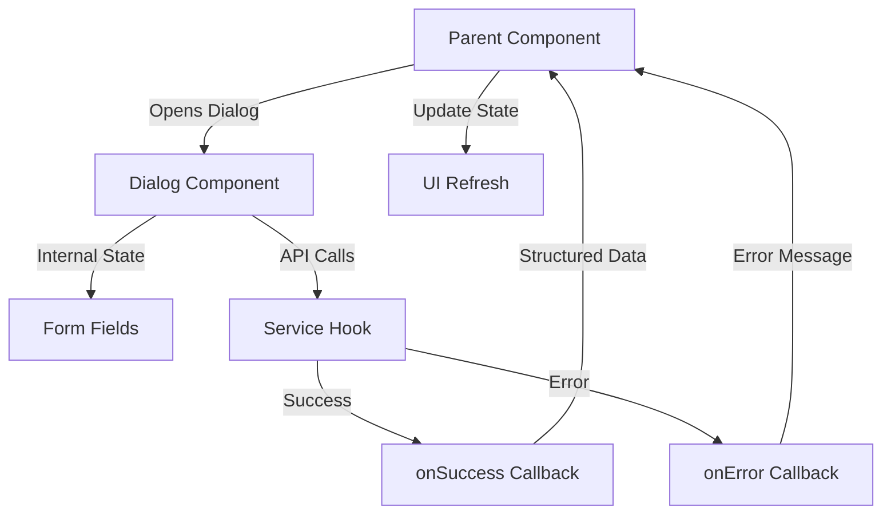
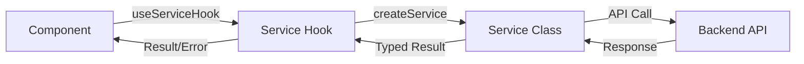
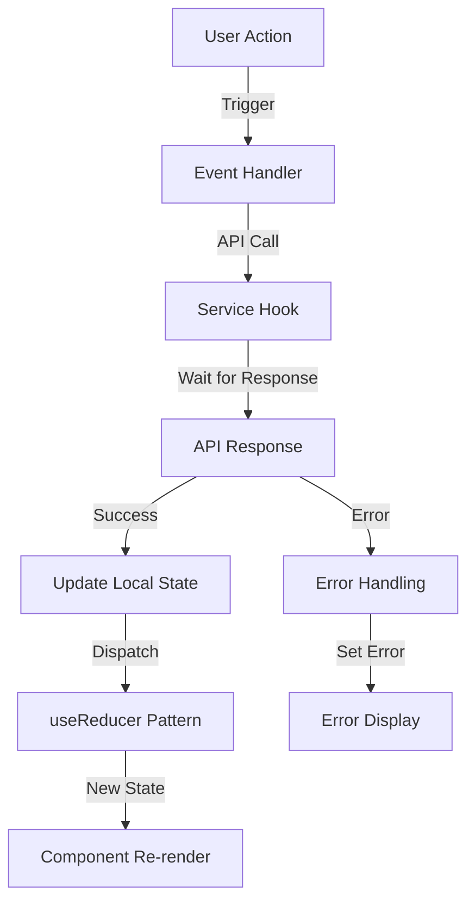
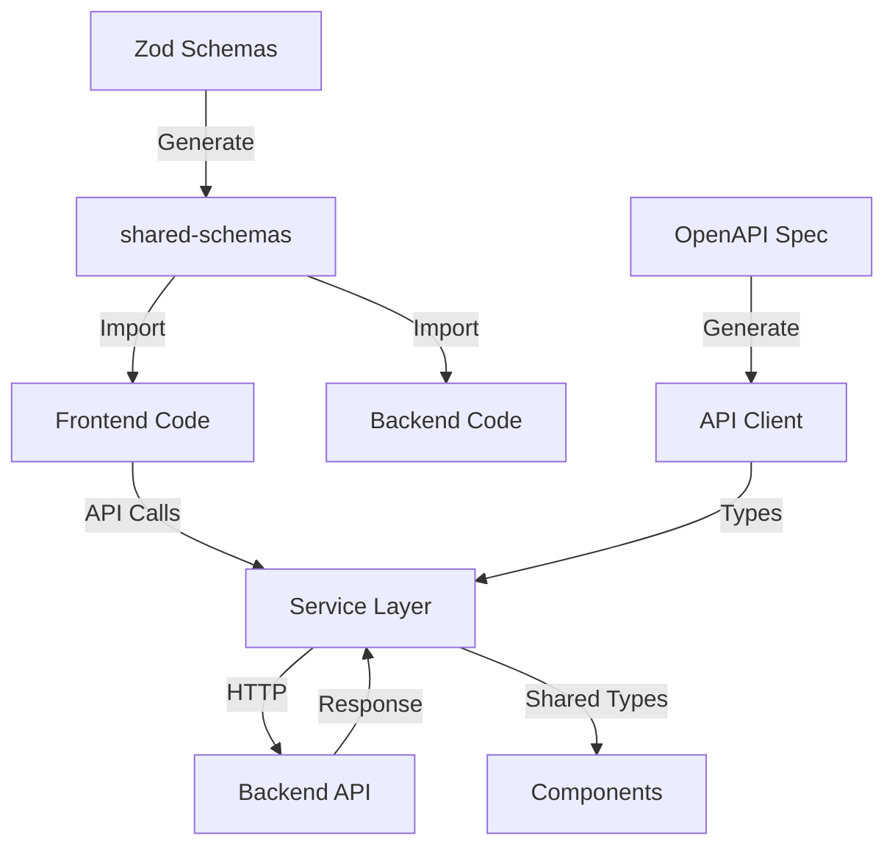
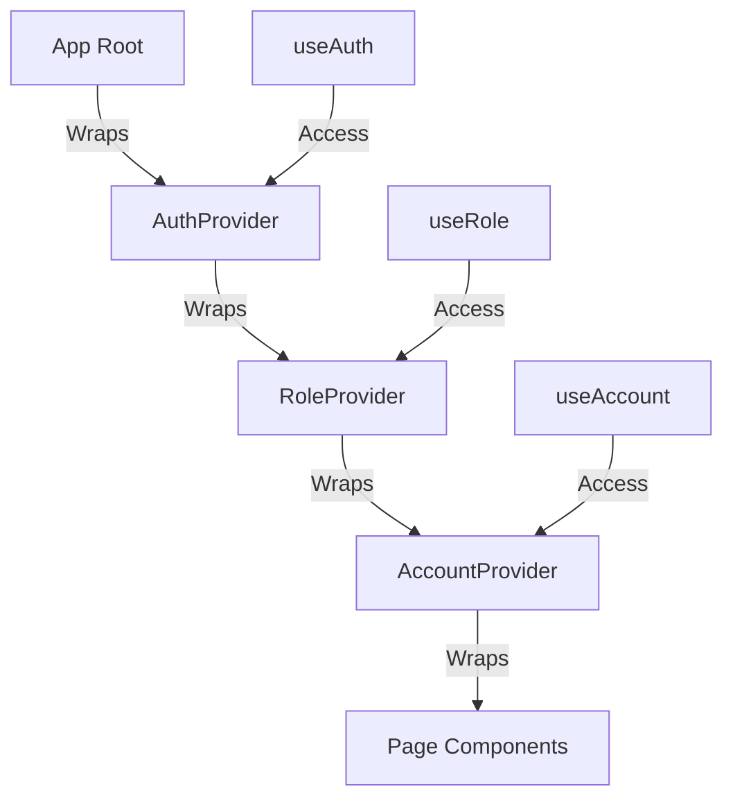
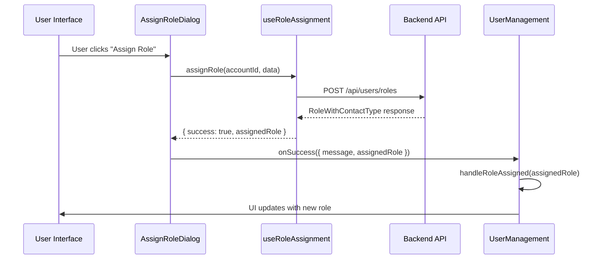

# Frontend Reference - ezRecSports

This document contains detailed examples, diagrams, full code implementations, and comprehensive patterns for the ezRecSports frontend. For essential patterns and rules, see [CLAUDE.md](./CLAUDE.md).

## Table of Contents
1. [Architecture Diagrams](#architecture-diagrams)
2. [Complete Dialog Implementation](#complete-dialog-implementation)
3. [Service Hook Implementations](#service-hook-implementations)
4. [Common Patterns](#common-patterns)
5. [Development Workflows](#development-workflows)
6. [Tools and Libraries](#tools-and-libraries)
7. [Migration Guidelines](#migration-guidelines)

---

## Architecture Diagrams

### Dialog Management Flow



### Service Hook Pattern



### State Management Flow



### Type System Architecture



### Context Hierarchy



### Real Data Update Pattern



---

## Complete Dialog Implementation

### Full Dialog Component Structure

```typescript
import React, { useState, useCallback } from 'react';
import {
  Dialog,
  DialogTitle,
  DialogContent,
  DialogActions,
  Button,
  TextField,
  CircularProgress,
  Alert,
} from '@mui/material';
import { ContactType } from '@draco/shared-schemas';

interface EditContactDialogProps {
  open: boolean;
  onClose: () => void;
  onSuccess?: (result: { message: string; data: ContactType }) => void;
  onError?: (error: string) => void;
  contact?: ContactType | null;
  loading?: boolean;
}

export const EditContactDialog: React.FC<EditContactDialogProps> = ({
  open,
  onClose,
  onSuccess,
  onError,
  contact,
  loading: externalLoading,
}) => {
  // Internal state management
  const [firstName, setFirstName] = useState(contact?.firstName || '');
  const [lastName, setLastName] = useState(contact?.lastName || '');
  const [email, setEmail] = useState(contact?.email || '');
  const [localError, setLocalError] = useState<string | null>(null);

  // Service hook for API operations
  const { updateContact, loading: updateLoading } = useContactOperations();

  const isLoading = externalLoading || updateLoading;

  // Reset form when dialog opens with new contact
  React.useEffect(() => {
    if (open && contact) {
      setFirstName(contact.firstName);
      setLastName(contact.lastName);
      setEmail(contact.email || '');
      setLocalError(null);
    }
  }, [open, contact]);

  // Handle form submission
  const handleSubmit = useCallback(async () => {
    setLocalError(null);

    if (!contact) {
      setLocalError('No contact selected');
      return;
    }

    if (!firstName.trim() || !lastName.trim()) {
      setLocalError('First name and last name are required');
      return;
    }

    const result = await updateContact(contact.id, {
      firstName: firstName.trim(),
      lastName: lastName.trim(),
      email: email.trim() || undefined,
    });

    if (result.success && result.data) {
      onSuccess?.({
        message: result.message || 'Contact updated successfully',
        data: result.data
      });
      onClose();
    } else {
      const errorMsg = result.error || 'Failed to update contact';
      setLocalError(errorMsg);
      onError?.(errorMsg);
    }
  }, [firstName, lastName, email, contact, updateContact, onSuccess, onError, onClose]);

  // Handle dialog close
  const handleClose = useCallback(() => {
    if (!isLoading) {
      setLocalError(null);
      onClose();
    }
  }, [isLoading, onClose]);

  return (
    <Dialog open={open} onClose={handleClose} maxWidth="sm" fullWidth>
      <DialogTitle>Edit Contact</DialogTitle>
      <DialogContent>
        {localError && (
          <Alert severity="error" sx={{ mb: 2 }}>
            {localError}
          </Alert>
        )}

        <TextField
          autoFocus
          margin="dense"
          label="First Name"
          type="text"
          fullWidth
          value={firstName}
          onChange={(e) => setFirstName(e.target.value)}
          disabled={isLoading}
          required
        />

        <TextField
          margin="dense"
          label="Last Name"
          type="text"
          fullWidth
          value={lastName}
          onChange={(e) => setLastName(e.target.value)}
          disabled={isLoading}
          required
        />

        <TextField
          margin="dense"
          label="Email"
          type="email"
          fullWidth
          value={email}
          onChange={(e) => setEmail(e.target.value)}
          disabled={isLoading}
        />
      </DialogContent>
      <DialogActions>
        <Button onClick={handleClose} disabled={isLoading}>
          Cancel
        </Button>
        <Button
          onClick={handleSubmit}
          variant="contained"
          disabled={isLoading}
        >
          {isLoading ? <CircularProgress size={24} /> : 'Save'}
        </Button>
      </DialogActions>
    </Dialog>
  );
};
```

### Parent Component Integration

```typescript
import React, { useState, useCallback } from 'react';
import { EditContactDialog } from './EditContactDialog';
import { ContactType } from '@draco/shared-schemas';

export const UserManagement: React.FC = () => {
  const [contacts, setContacts] = useState<ContactType[]>([]);
  const [selectedContact, setSelectedContact] = useState<ContactType | null>(null);
  const [dialogOpen, setDialogOpen] = useState(false);
  const [success, setSuccess] = useState<string | null>(null);
  const [error, setError] = useState<string | null>(null);

  // Open dialog for editing
  const handleEditClick = useCallback((contact: ContactType) => {
    setSelectedContact(contact);
    setDialogOpen(true);
    setSuccess(null);
    setError(null);
  }, []);

  // Handle successful edit
  const handleEditSuccess = useCallback((result: { message: string; data: ContactType }) => {
    setSuccess(result.message);

    // Update contact in local state with real API data
    setContacts(prevContacts =>
      prevContacts.map(c =>
        c.id === result.data.id ? result.data : c
      )
    );

    setDialogOpen(false);
    setSelectedContact(null);
  }, []);

  // Handle edit error
  const handleEditError = useCallback((errorMessage: string) => {
    setError(errorMessage);
  }, []);

  return (
    <>
      {/* Success/Error messages */}
      {success && <Alert severity="success">{success}</Alert>}
      {error && <Alert severity="error">{error}</Alert>}

      {/* Contact list */}
      {contacts.map(contact => (
        <ContactCard
          key={contact.id}
          contact={contact}
          onEdit={() => handleEditClick(contact)}
        />
      ))}

      {/* Edit dialog */}
      <EditContactDialog
        open={dialogOpen}
        onClose={() => setDialogOpen(false)}
        onSuccess={handleEditSuccess}
        onError={handleEditError}
        contact={selectedContact}
      />
    </>
  );
};
```

---

## Service Hook Implementations

### Complete Service Hook Pattern

```typescript
import { useState, useCallback } from 'react';
import { useAuth } from '@/context/AuthContext';
import { useCurrentSeason } from '@/hooks/useCurrentSeason';
import { createContactService } from '@/services/contactService';
import { ContactType, CreateContactType, UpdateContactType } from '@draco/shared-schemas';

interface ContactOperationResult {
  success: boolean;
  message?: string;
  data?: ContactType;
  error?: string;
}

export function useContactOperations(accountId: string) {
  const [loading, setLoading] = useState(false);
  const { token } = useAuth();
  const { currentSeasonId } = useCurrentSeason(accountId);
  const service = token ? createContactService(token) : null;

  const createContact = useCallback(async (
    contactData: CreateContactType
  ): Promise<ContactOperationResult> => {
    if (!service) {
      return { success: false, error: 'Service not available' };
    }

    try {
      setLoading(true);

      const result = await service.create(accountId, contactData);

      return {
        success: true,
        message: 'Contact created successfully',
        data: result
      };
    } catch (err) {
      console.error('Create contact error:', err);
      const errorMessage = err instanceof Error ? err.message : 'Failed to create contact';
      return { success: false, error: errorMessage };
    } finally {
      setLoading(false);
    }
  }, [service, accountId]);

  const updateContact = useCallback(async (
    contactId: string,
    updates: UpdateContactType
  ): Promise<ContactOperationResult> => {
    if (!service) {
      return { success: false, error: 'Service not available' };
    }

    try {
      setLoading(true);

      const result = await service.update(accountId, contactId, updates);

      return {
        success: true,
        message: 'Contact updated successfully',
        data: result
      };
    } catch (err) {
      console.error('Update contact error:', err);
      const errorMessage = err instanceof Error ? err.message : 'Failed to update contact';
      return { success: false, error: errorMessage };
    } finally {
      setLoading(false);
    }
  }, [service, accountId]);

  const deleteContact = useCallback(async (
    contactId: string
  ): Promise<ContactOperationResult> => {
    if (!service) {
      return { success: false, error: 'Service not available' };
    }

    try {
      setLoading(true);

      await service.delete(accountId, contactId);

      return {
        success: true,
        message: 'Contact deleted successfully'
      };
    } catch (err) {
      console.error('Delete contact error:', err);
      const errorMessage = err instanceof Error ? err.message : 'Failed to delete contact';
      return { success: false, error: errorMessage };
    } finally {
      setLoading(false);
    }
  }, [service, accountId]);

  return {
    createContact,
    updateContact,
    deleteContact,
    loading
  };
}
```

---

## Common Patterns

### Dialog Manager Hook (Complete Implementation)

```typescript
import { useState } from 'react';

interface DialogState<T = any> {
  isOpen: boolean;
  data: T | null;
}

interface DialogActions<T = any> {
  open: (data?: T) => void;
  close: () => void;
  isOpen: boolean;
  data: T | null;
}

export function useDialogManager<T extends Record<string, any> = Record<string, any>>() {
  const [dialogStates, setDialogStates] = useState<Record<string, DialogState>>(() => {
    const initialStates: Record<string, DialogState> = {};
    return initialStates;
  });

  const createDialogActions = <K extends keyof T>(dialogName: K): DialogActions<T[K]> => {
    // Initialize state if not exists
    if (!dialogStates[dialogName as string]) {
      setDialogStates(prev => ({
        ...prev,
        [dialogName]: { isOpen: false, data: null }
      }));
    }

    return {
      open: (data?: T[K]) => setDialogStates(prev => ({
        ...prev,
        [dialogName]: { isOpen: true, data: data ?? null }
      })),
      close: () => setDialogStates(prev => ({
        ...prev,
        [dialogName]: { isOpen: false, data: null }
      })),
      isOpen: dialogStates[dialogName as string]?.isOpen ?? false,
      data: dialogStates[dialogName as string]?.data ?? null,
    };
  };

  return {
    createDialog: createDialogActions,
  };
}

// Usage example:
const dialogs = useDialogManager<{
  editContact: ContactType;
  deleteContact: { contactId: string; contactName: string };
  assignRole: { contactId: string };
}>();

const editDialog = dialogs.createDialog('editContact');
const deleteDialog = dialogs.createDialog('deleteContact');
const assignRoleDialog = dialogs.createDialog('assignRole');

// Open with data
editDialog.open(contactData);
deleteDialog.open({ contactId: '123', contactName: 'John Doe' });

// Close
editDialog.close();
```

### Service Factory Pattern

```typescript
import { createContactService } from './contactService';
import { createUserService } from './userService';
import { createRoleService } from './roleService';
import { createAccountService } from './accountService';

export function createServiceFactory(token: string) {
  return {
    contacts: createContactService(token),
    users: createUserService(token),
    roles: createRoleService(token),
    accounts: createAccountService(token),
  };
}

// Usage:
const services = createServiceFactory(token);
const contact = await services.contacts.getById(accountId, contactId);
```

### Real Data Update Pattern (Complete)

```typescript
// In Dialog Component
const handleAssign = useCallback(async () => {
  setLocalError(null);

  if (!selectedRole || !contactId) {
    setLocalError('Please select a role and contact');
    return;
  }

  const result = await assignRole(accountId, {
    roleId: selectedRole,
    contactId,
    leagueId: selectedLeagueId || undefined,
    teamId: selectedTeamId || undefined,
  });

  // Only proceed on real API success
  if (result.success && result.assignedRole) {
    onSuccess?.({
      message: result.message || 'Role assigned successfully',
      assignedRole: result.assignedRole
    });
    onClose();
  } else {
    const errorMsg = result.error || 'Failed to assign role';
    setLocalError(errorMsg);
    onError?.(errorMsg);
  }
}, [selectedRole, contactId, selectedLeagueId, selectedTeamId, accountId, assignRole, onSuccess, onError, onClose]);

// In Parent Component
const handleAssignRoleSuccess = useCallback((result: { message: string; assignedRole: RoleWithContactType }) => {
  setSuccess(result.message);

  // Update state only after receiving real API data
  handleRoleAssigned(result.assignedRole);
  dialogs.assignRoleDialog.close();
}, [setSuccess, handleRoleAssigned, dialogs.assignRoleDialog]);
```

---

## Development Workflows

### Feature Development Checklist

1. **Design Component Interface**
   - Define props with proper TypeScript types
   - Import types from `@draco/shared-schemas`
   - Design callback structure (`onSuccess`, `onError`)
   - Plan state management approach

2. **Implement Service Hook**
   - Create custom hook in `/hooks`
   - Use `useAuth()` for token
   - Handle loading and error states
   - Return typed results

3. **Build Component**
   - Implement UI with Material-UI components
   - Manage internal state with `useState`
   - Use `useCallback` for event handlers
   - Add loading spinners and error displays

4. **Add Dialog Support**
   - Implement self-contained dialog component
   - Use event callbacks for parent communication
   - Reset state on close
   - Handle validation errors

5. **Test Integration**
   - Verify data flow from dialog → hook → API
   - Test error handling paths
   - Verify state updates after API success
   - Check loading states

### Type Safety Workflow

1. **Check Shared Schemas**
   - Search in `@draco/shared-schemas` for existing types
   - Don't create duplicate types locally

2. **Import Types**
   ```typescript
   import { ContactType, CreateContactType } from '@draco/shared-schemas';
   ```

3. **Validate API Contracts**
   - Ensure frontend types match backend
   - Run `npm run sync:api` after backend changes
   - Check for TypeScript errors

4. **Test Type Safety**
   - Enable strict mode in `tsconfig.json`
   - Fix all type errors before committing
   - Use TypeScript's inference where possible

### Dialog Implementation Workflow

1. **Design Dialog Interface**
   ```typescript
   interface MyDialogProps {
     open: boolean;
     onClose: () => void;
     onSuccess?: (result: { message: string; data: TypedData }) => void;
     onError?: (error: string) => void;
     contextData?: ContextType[];
   }
   ```

2. **Implement Internal State**
   - Use `useState` for form fields
   - Initialize from props when appropriate
   - Reset on dialog close

3. **Add Service Integration**
   - Create or use existing service hook
   - Handle loading states
   - Process success/error results

4. **Handle Success/Error**
   - Call `onSuccess` with typed data
   - Call `onError` with error message
   - Close dialog on success

5. **Test Data Flow**
   - Open dialog with initial data
   - Submit form and verify API call
   - Check parent state updates
   - Test error scenarios

---

## Tools and Libraries

### Development Tools
- **TypeScript 5.8.3** - Strict mode enabled for maximum type safety
- **ESLint** - Configured with React and TypeScript rules
- **Prettier** - Consistent code formatting
- **Next.js DevTools** - Built-in development tools

### UI Libraries
- **Material-UI 7.2.0** - Component library and theming
- **Emotion 11.14.0** - CSS-in-JS styling
- **Tailwind CSS 4.0** - Utility-first CSS framework

### Form & Validation
- **React Hook Form** - Form handling and validation
- **Zod** - Schema validation (via shared-schemas)
- **@hookform/resolvers** - Integration between RHF and Zod

### State Management
- **React Context API** - Global state (Auth, Role, Account)
- **useState/useReducer** - Local component state

### HTTP & API
- **Axios 1.10.0** - HTTP client
- **@draco/shared-api-client** - Generated OpenAPI client
- **@draco/shared-schemas** - Shared type definitions

### Testing Tools
- **Vitest** - Unit testing framework
- **React Testing Library** - Component testing
- **@testing-library/user-event** - User interaction simulation

### Utilities
- **date-fns 4.1.0** - Date manipulation
- **react-markdown** - Markdown rendering
- **lexical** - Rich text editor framework

---

## Migration Guidelines

When updating existing components to follow these patterns:

1. **Extract Dialog State**
   - Move dialog-specific state from parent to dialog component
   - Keep only dialog open/close state in parent
   - Pass data via props instead of managing in parent

2. **Add Event Callbacks**
   - Replace direct state manipulation with callbacks
   - Use `onSuccess` with typed result data
   - Use `onError` for error messages
   - Let parent decide how to handle results

3. **Use Service Hooks**
   - Replace direct API calls with service hooks
   - Centralize error handling in hooks
   - Return consistent result format
   - Handle loading states in hooks

4. **Update Types**
   - Replace local interfaces with shared schema types
   - Import from `@draco/shared-schemas`
   - Remove duplicate type definitions
   - Use TypeScript inference where possible

5. **Test Real Updates**
   - Remove optimistic updates
   - Wait for API responses before updating state
   - Verify state updates work with real data only
   - Test error recovery paths
